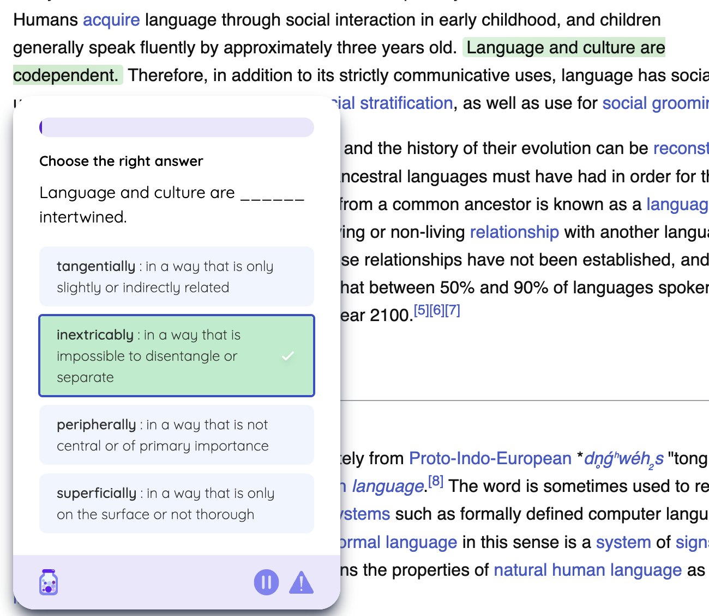
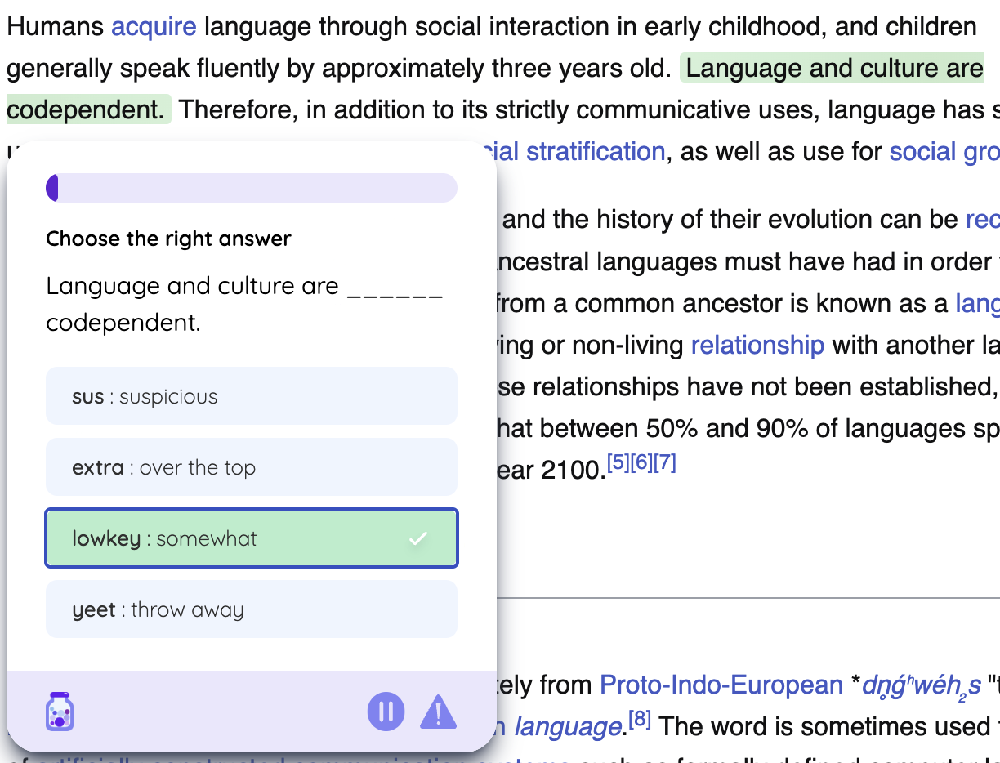

```{r setup, include=FALSE}
knitr::opts_chunk$set(echo = FALSE, warning = FALSE, message = FALSE)
library(tidyverse)
library(lubridate)
library(knitr)
library(kableExtra)
```

# Introduction

## Background and Motivation

Jargon is an innovative Chrome extension ([Chrome Web Store](https://chromewebstore.google.com/detail/jargon/gghkanaadhldgmknmgggdgfaonhpppoj), [Official Website](https://www.jargonlearn.com/)) created by my friend that transforms English web content into learning opportunities using generative AI technology. Launched in June 2024, Jargon offers two types of learning experiences: foreign language learning (Spanish, Chinese, etc.) and English style adaptation (GRE vocabulary, TikTok slang, etc.).


### How Jargon Works

#### Customization Options

<div class="row align-items-center" style="margin: 30px 0;">
<div class="col-md-6">
```{r, echo=FALSE, fig.align='center', out.width='90%'}
knitr::include_graphics("img/userSetting.png")
```
*Figure 1: User Settings Interface showing customization options*
</div>

<div class="col-md-6">
<div class="settings-description" style="padding: 0 20px;">
<h4 style="color: #333; margin-bottom: 30px;">Key Features</h4>

<div style="margin-bottom: 30px;">
<p style="color: #4a5568;">Language Selection</p>
Choose between foreign languages (Spanish, Chinese) or English modes (GRE, TikTok)
</div>

<div style="margin-bottom: 30px;">
<p style="color: #4a5568;">Learning Goals</p>
• Difficulty: Easy-Hard (1-10) <br>
• Daily Target: 10-100 questions
</div>

<div style="margin-bottom: 30px;">
<p style="color: #4a5568;">Question Density</p>
Controls percentage of eligible sentences (0-100%) highlighted for practice on each webpage
</div>

<div style="margin-bottom: 0;">
<p style="color: #4a5568;">Display Settings</p>
• Text Style: Highlight or underline<br>
• Site Controls: Enable/disable per website or temporarily
</div>
</div>
</div>
</div>

#### Text Selection Methods
<div style="display: flex; justify-content: center; gap: 20px; margin: 20px 0;">
  <figure style="text-align: center; margin: 0;">
    
    <figcaption style="margin: 10px 0;"><em>Figure 2a: Highlight Style - Text appears with background color emphasis</em></figcaption>
  </figure>
  <figure style="text-align: center; margin: 0;">
    
    <figcaption style="margin: 10px 0;"><em>Figure 2b: Underline Style - Text appears with underline emphasis</em></figcaption>
  </figure>
</div>

#### Language Transformation Examples
<div style="text-align: center; margin-top: 20px;">
  
  <figcaption style="margin: 10px 0 30px;"><em>Figure 3: Question Generation Process - Users select text from any webpage to create practice questions</em></figcaption>
</div>

<div style="display: flex; justify-content: center; align-items: center; gap: 20px; margin: 20px auto; max-width: 1200px; overflow: hidden;">
  <figure style="text-align: center; margin: 0; width: 33%;">
    
    <figcaption style="margin: 10px 0;"><em>Figure 4a: GRE Mode - Advanced vocabulary transformation</em></figcaption>
  </figure>
  <figure style="text-align: center; margin: 0; width: 33%;">
    
    <figcaption style="margin: 10px 0;"><em>Figure 4b: TikTok Style - Contemporary social media language</em></figcaption>
  </figure>
  <figure style="text-align: center; margin: 0; width: 33%;">
    
    <figcaption style="margin: 10px 0;"><em>Figure 4c: Spanish Mode - English to Spanish translation</em></figcaption>
  </figure>
</div>

The GRE mode enhances vocabulary learning by replacing common words with their more sophisticated alternatives (e.g., "good" becomes "exemplary"), while TikTok style transforms formal English into contemporary social media expressions (e.g., "That's cool" becomes "That's bussin fr fr"). These AI-powered transformations maintain the original meaning while adapting to different language registers.

## Research Questions and Hypotheses

After 10 months of operation and 93 users, this analysis investigates three key aspects of user behavior:

1. **Usage Context and Platform Patterns**
   - Research Question: "What are the common contexts and platforms where users engage with Jargon?"
   - Hypothesis: Users primarily engage with Jargon on social media or entertainment sites and banned academic sites.
   - Rationale: Understanding where users naturally integrate Jargon into their browsing can inform platform-specific optimization and marketing strategies.

2. **Language Learning Behavior**
   - Research Question: "Do users tend to focus on a single language/mode or explore multiple options?"
   - Hypothesis: Most users stick to a single language/mode.
   - Rationale: This will help prioritize development efforts and understand if users treat Jargon as a focused learning tool or an exploratory platform.

3. **Feature Adoption and User Success**
   - Research Question: "What features and settings distinguish active users from occasional users?"
   - Hypothesis: Active users utilize more customization options (density settings, highlight styles) and has achievable daily goals.
   - Rationale: Identifying the features that correlate with sustained engagement can guide onboarding improvements and feature prioritization.

# Methods

## Data Collection

The data was collected from Jargon's Supabase database on March 16, 2025, covering all real-life usage data since launch. 

## Data Processing

### Data Sources

#### 1. Profiles Dataset
| Variable | Description | Type | Notes |
|----------|-------------|------|-------|
| user_id | Unique identifier for each user | Primary Key | Anonymized identifier |
| level | Current proficiency level | Integer | Range: 1-10 |
| paused | Extension status on Chrome | Boolean | TRUE/FALSE (Default: TRUE) |
| chrome_notifs | Notification preferences | Boolean | TRUE/FALSE |
| language | Current selected language mode | String | e.g., "GRE Vocabulary", "TikTok Slang" |
| last_question_time | Timestamp of most recent question | DateTime | UTC timezone |
| week_streak | Consecutive weeks of activity | Integer | |
| daily_streak | Consecutive days of activity | Integer | |
| daily_progress | Questions completed today | Integer | Resets daily |
| daily_goal | Target questions per day | Integer | User-set goal |
| density | Frequency of questions | Integer | Percentage of eligible sentences shown (0-100) |
| highlightStyle | Text selection preference | String | "highlight" or "underline" |
| bonus_points | Engagement reward points | Integer | Earned from community activities |

#### 2. Questions Dataset
| Variable | Description | Type | Notes |
|----------|-------------|------|-------|
| question_id | Unique question identifier | Primary Key | |
| user_id | Associated user | Foreign Key | References profiles |
| created_at | Question generation time | DateTime | UTC timezone |
| sentence | Original selected text | Text | English source content |
| word | Target word for learning | String | |
| language | Transformation mode | String | Selected language mode |
| original_sentence | Source text | Text | Pre-transformation content |
| options_array | Multiple choice options | Array of String | Even indices: options in target language; Odd indices: English translations |
| answered_at | Completion timestamp | DateTime | NULL if unanswered |
| chosen_option | User's answer | String | NULL if unanswered |
| user_rating | Question quality rating | Integer | Feature not yet implemented |

#### 3. Words Dataset
| Variable | Description | Type | Notes |
|----------|-------------|------|-------|
| created_at | Word entry timestamp | DateTime | UTC timezone |
| word | Target vocabulary | String | |
| language | Language mode | String | |
| user_id | Associated user | Foreign Key | References profiles |
| translation | English translation | Text | AI-generated translation |
| status | Learning status | String | Currently all set to "learning" |

#### 4. Levels Dataset
| Variable | Description | Type | Notes |
|----------|-------------|------|-------|
| user_id | Associated user | Foreign Key | References profiles |
| language | Language mode | String | |
| level | Difficulty level | Integer | Range: 1-10 |

#### 5. Websites Dataset
| Variable | Description | Type | Notes |
|----------|-------------|------|-------|
| user_id | Associated user | Foreign Key | References profiles |
| website | Blocked URL | String | Sites where Jargon is disabled |

### Derived Variables
For analysis purposes, we enhanced the Profiles dataset with the following derived metrics:

| Variable | Description | Derivation Method | Source Tables |
|----------|-------------|-------------------|---------------|
| generated_questions | Total questions per user | Count of entries | questions |
| answered_questions | Completed questions | Count of answered entries | words |
| blocked_sites | Number of blocked websites | Count of entries | websites |
| levels_attempted | Number of unique levels tried | Count of distinct levels | levels |

### Data Preparation
```{r data_processing, echo=FALSE}
# Load required libraries
library(tidyverse)
library(lubridate)

# Read the CSV files
profiles <- read.csv("data/profiles_rows_cleaned.csv")
questions <- read.csv("data/questions_rows.csv")
words <- read.csv("data/words_rows.csv")
levels <- read.csv("data/levels_rows.csv")
websites <- read.csv("data/website_blacklist_rows.csv")

# Clean and enhance profiles data
enhanced_profiles <- profiles %>%
  # Add total questions generated per user
  left_join(
    questions %>%
      group_by(user_id) %>%
      summarise(generated_questions = n()),
    by = "user_id"
  ) %>%
  # Add total questions answered per user
  left_join(
    questions %>%
      filter(!is.na(answered_at)) %>%
      group_by(user_id) %>%
      summarise(answered_questions = n()),
    by = "user_id"
  ) %>%
  # Add number of blocked websites per user
  left_join(
    websites %>%
      group_by(user_id) %>%
      summarise(blocked_sites = n()),
    by = "user_id"
  ) %>%
  # Add number of unique levels attempted per user
  left_join(
    levels %>%
      group_by(user_id) %>%
      mutate(language_level = paste(language, level, sep = "_")) %>%
      summarise(distinct_combinations = n_distinct(language_level), .groups = 'drop')
  ) %>%
  # Replace NA values with 0 for derived metrics
  mutate(
    generated_questions = replace_na(generated_questions, 0),
    answered_questions = replace_na(answered_questions, 0),
    blocked_sites = replace_na(blocked_sites, 0),
    distinct_combinations = replace_na(distinct_combinations, 0)
  )


```

The data preparation workflow involved:

1. **Data Integration**: Combined five primary datasets using user_id as the key identifier
2. **Feature Engineering**: Created four derived metrics:
   - Total questions generated
   - Questions answered
   - Blocked websites count
   - Unique levels attempted
3. **Missing Value Treatment**: Replaced NA values with 0 for derived metrics

## Analysis Methods

### Descriptive Statistics
- Temporal patterns analysis using daily and weekly aggregations
- User segmentation based on engagement levels
- Language mode preference analysis

### Engagement Metrics


# Results

## User Engagement Analysis

### Overall Usage Patterns


### Language Mode Preferences


## User Retention Analysis

### Activity Patterns


# Conclusions and Summary

## Key Findings

1. **Usage Context and Platform Patterns**
   - [Summary of actual findings from your data about platform usage]
   - [Insights about language mode preferences]

2. **Language Learning Behavior**
   - [Summary of findings about language mode usage]
   - [Patterns in language mode switching]

3. **Feature Adoption and User Success**
   - [Summary of findings about feature usage]
   - [Patterns in feature adoption]

## Limitations

1. **Sample Size**
   - Limited user base (93 users) affects statistical power
   - Early adoption phase may not represent typical usage

2. **Time Frame**
   - 10-month observation period may not capture long-term learning patterns
   - Launch period effects may influence usage patterns

## Future Directions

1. **Product Development**
   - [Recommendations based on actual findings]
   - [Suggested improvements supported by data]

2. **Research Extensions**
   - Longer-term user tracking needed
   - Investigation of specific feature impacts on retention
