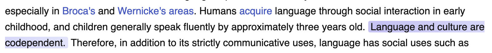
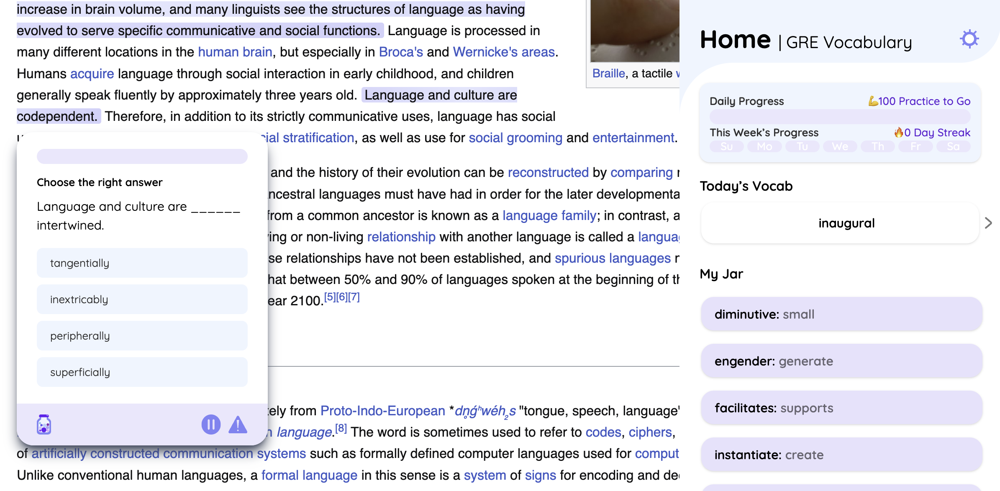
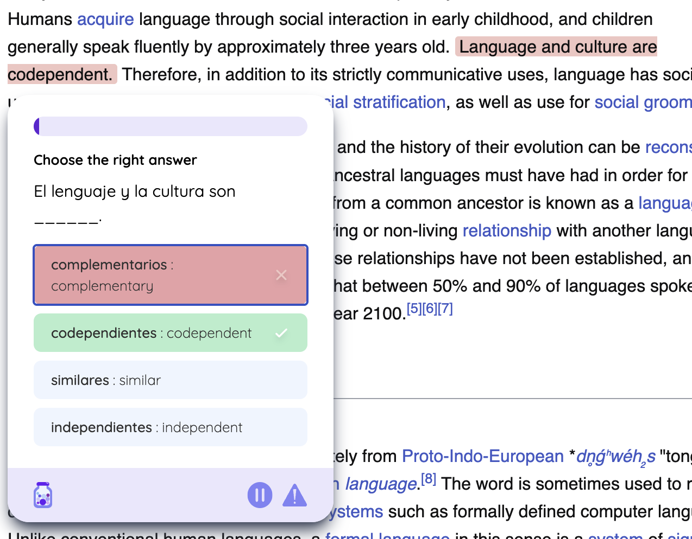

```{r setup, include=FALSE}
# Set chunk options
knitr::opts_chunk$set(echo = FALSE, warning = FALSE, message = FALSE)

# Load packages
library(tidyverse)
library(lubridate)
library(knitr)
library(kableExtra)
library(urltools)
library(gridExtra)
library(ggplot2)
library(treemapify)
library(RColorBrewer)
library(grid)
library(syuzhet)
library(stopwords)
library(patchwork)
library(broom)
library(caret)
library(Metrics)
library(dplyr)
library(ggplot2)
library(scales)
library(FactoMineR)
library(factoextra)
library(ggplot2)
library(dplyr)
library(tidytext)
library(topicmodels)
library(stringr)
library(corrplot)


# Try to load required visualization packages
has_ggrepel <- require(ggrepel)
has_wordcloud <- require(wordcloud)

# Read the CSV files
profiles <- read.csv("data/profiles_rows_cleaned.csv")
questions <- read.csv("data/questions_rows.csv")
words <- read.csv("data/words_rows.csv")
levels <- read.csv("data/levels_rows.csv")
websites <- read.csv("data/website_blacklist_rows.csv")
```

# Introduction

## Background and Motivation

Jargon is an innovative Chrome extension ([Chrome Web Store](https://chromewebstore.google.com/detail/jargon/gghkanaadhldgmknmgggdgfaonhpppoj), [Official Website](https://www.jargonlearn.com/)) created by my friend that transforms English web content into learning opportunities using generative AI technology. Launched in June 2024, Jargon offers two types of learning experiences: foreign language learning (Spanish, Chinese, etc.) and English style adaptation (GRE vocabulary, TikTok slang, etc.).

### How Jargon Works

#### Customization Options

:::::::::: {.row .align-items-center style="margin: 30px 0;"}
::: col-md-6
```{r, echo=FALSE, fig.align='center', out.width='90%'}
knitr::include_graphics("img/userSetting.png")
```

*Figure 1: User Settings Interface showing customization options*
:::

:::::::: col-md-6
::::::: {.settings-description style="padding: 0 20px;"}
<h4 style="color: #333; margin-bottom: 30px;">

Key Features

</h4>

::: {style="margin-bottom: 30px;"}
<p style="color: #4a5568;">

Language Selection

</p>

All types, from foreign languages like Spanish and Chinese to English variations such as TikTok Slang
:::

::: {style="margin-bottom: 30px;"}
<p style="color: #4a5568;">

Learning Goals

</p>

• Difficulty: Easy-Hard (1-10) <br> • Daily Target: 10-100 questions
:::

::: {style="margin-bottom: 30px;"}
<p style="color: #4a5568;">

Question Density

</p>

Controls percentage of eligible sentences (0-100%) highlighted for practice on each webpage
:::

::: {style="margin-bottom: 0;"}
<p style="color: #4a5568;">

Display Settings

</p>

• Text Style: Highlight or underline<br> • Site Controls: Enable/disable per website or temporarily
:::
:::::::
::::::::
::::::::::

#### Text Selection Methods

::: {style="display: flex; justify-content: center; gap: 20px; margin: 20px 0;"}
<figure style="text-align: center; margin: 0;">



<figcaption style="margin: 10px 0;">

<em>Figure 2a: Highlight Style - Text appears with background color emphasis</em>

</figcaption>

</figure>

<figure style="text-align: center; margin: 0;">


<figcaption style="margin: 10px 0;">

<em>Figure 2b: Underline Style - Text appears with underline emphasis</em>

</figcaption>

</figure>
:::

Underline style was the default option initially provided by Jargon. Based on user feedback, the highlight style was introduced, offering an alternative that users can switch to for a better UI experience.

#### Language Transformation Examples

::: {style="text-align: center; margin-top: 20px;"}


<figcaption style="margin: 10px 0 30px;">

<em>Figure 3: Question Generation Process - Users select text from any webpage to create practice questions</em>

</figcaption>
:::

::: {style="display: flex; justify-content: center; align-items: center; gap: 20px; margin: 20px auto; max-width: 1200px; overflow: hidden;"}
<figure style="text-align: center; margin: 0; width: 33%;">


<figcaption style="margin: 10px 0;">

<em>Figure 4a: GRE Mode - Advanced vocabulary transformation</em>

</figcaption>

</figure>

<figure style="text-align: center; margin: 0; width: 33%;">


<figcaption style="margin: 10px 0;">

<em>Figure 4b: TikTok Style - Contemporary social media language</em>

</figcaption>

</figure>

<figure style="text-align: center; margin: 0; width: 33%;">



<figcaption style="margin: 10px 0;">

<em>Figure 4c: Spanish Mode - English to Spanish translation</em>

</figcaption>

</figure>
:::

The GRE mode enhances vocabulary learning by replacing common words with their more sophisticated alternatives (e.g., "good" becomes "exemplary"), while TikTok style transforms formal English into contemporary social media expressions (e.g., "That's cool" becomes "That's bussin fr fr"). These AI-powered transformations maintain the original meaning while adapting to different language registers.

## Research Questions and Hypotheses

After 10 months of operation and 92 users, this analysis investigates two key aspects of user behavior:

1.  **Usage Context and Platform Patterns**
    -   Research Question: "What are the common contexts and platforms where users engage with Jargon?"
    -   Hypothesis: Users primarily engage with Jargon on social media or entertainment sites and banned academic sites.
    -   Rationale: Understanding where users naturally integrate Jargon into their browsing can inform platform-specific optimization and marketing strategies.
2.  **Feature Adoption and User Success**
    -   Research Question: "What features and settings distinguish active users from occasional users?"
    -   Hypothesis: Active users utilize more customization options (density settings, highlight styles) and has achievable daily goals.
    -   Rationale: Identifying the features that correlate with sustained engagement can guide onboarding improvements and feature prioritization.

# Methods

## Data Collection

The data for this analysis was collected from Jargon's Supabase database, covering user interactions from the extension's launch in June 2024 through March 16, 2025. The dataset comprises five main tables:

```{r data_summary_table, echo=FALSE}
# Create summary statistics for each dataset
data_summary <- tibble(
  `Dataset` = c("Profiles", "Questions", "Words", "Levels", "Websites"),
  `Records` = c(nrow(profiles), nrow(questions), nrow(words), nrow(levels), nrow(websites)),
  `Description` = c(
    "User profiles and settings",
    "Generated practice questions",
    "Vocabulary entries and translations",
    "User progression through difficulty levels",
    "Websites where extension was disabled"
  )
)

kable(data_summary, 
      caption = NULL) %>%
  kable_styling(bootstrap_options = c("striped", "hover", "condensed"),
                position = "center", full_width = FALSE) %>%
  footnote(general = "<em style='color: black; font-size: 16px;'>Table 1: Overview of Dataset Components</em>", general_title = "", footnote_as_chunk = TRUE, escape = FALSE)
```

### Dataset Descriptions

#### 1. Profiles Dataset
```{r profiles_summary, echo=FALSE}
# Create summary of key variables in profiles
profile_vars <- tibble(
  Variable = c("user_id", "level", "paused", "chrome_notifs", "language", 
               "last_question_time",
               "daily_goal", "density", "highlightStyle"),
  Type = c("Primary Key", "Integer", "Boolean", "Boolean", "String",
           "DateTime",
           "Integer", "Integer", "String"),
  Description = c(
    "Unique identifier for each user",
    "Current proficiency level",
    "Extension status on Chrome",
    "Notification preferences",
    "Current selected language mode",
    "Timestamp of most recent question",
    "Target questions per day",
    "Frequency of questions",
    "Text selection preference"
  ),
  Notes = c(
    "Anonymized identifier",
    "Range: 1-10",
    "TRUE/FALSE (Default: TRUE)",
    "TRUE/FALSE",
    "e.g., 'GRE Vocabulary', 'TikTok Slang'",
    "UTC timezone",
    "User-set goal",
    "Percentage of eligible sentences shown (0-100)",
    "'highlight' or 'underline'"
  )
)

kable(profile_vars,
      caption = NULL) %>%
  kable_styling(bootstrap_options = c("striped", "hover", "condensed"),
                position = "center", full_width = FALSE) %>%
  footnote(general = "<em style='color: black; font-size: 16px;'>Table 2: Key Variables in Profiles Dataset</em>", general_title = "", footnote_as_chunk = TRUE, escape = FALSE)
```

#### 2. Questions Dataset
```{r questions_summary, echo=FALSE}
# Create summary of key variables in questions
question_vars <- tibble(
  Variable = c("question_id", "user_id", "created_at", "sentence", "word",
               "language", "original_sentence", "options_array", "answered_at",
               "chosen_option", "user_rating"),
  Type = c("Primary Key", "Foreign Key", "DateTime", "Text", "String",
           "String", "Text", "Array of String", "DateTime",
           "String", "Integer"),
  Description = c(
    "Unique question identifier",
    "Associated user",
    "Question generation time",
    "Original selected text",
    "Target word for learning",
    "Transformation mode",
    "Source text",
    "Multiple choice options",
    "Completion timestamp",
    "User's answer",
    "Question quality rating"
  ),
  Notes = c(
    "",
    "References profiles",
    "UTC timezone",
    "English source content",
    "",
    "Selected language mode",
    "Pre-transformation content",
    "Even indices: options in target language; Odd indices: English translations",
    "NULL if unanswered",
    "NULL if unanswered",
    "Feature not yet implemented"
  )
)

kable(question_vars,
      caption = NULL) %>%
  kable_styling(bootstrap_options = c("striped", "hover", "condensed"),
                position = "center", full_width = FALSE) %>%
  footnote(general = "<em style='color: black; font-size: 16px;'>Table 3: Key Variables in Questions Dataset</em>", general_title = "", footnote_as_chunk = TRUE, escape = FALSE)
```

#### 3. Words Dataset
```{r words_summary, echo=FALSE}
# Create summary of key variables in words
words_vars <- tibble(
  Variable = c("created_at", "word", "language", "user_id", "translation", "status"),
  Type = c("DateTime", "String", "String", "Foreign Key", "Text", "String"),
  Description = c(
    "Word entry timestamp",
    "Target vocabulary",
    "Language mode",
    "Associated user",
    "English translation",
    "Learning status"
  ),
  Notes = c(
    "UTC timezone",
    "",
    "",
    "References profiles",
    "AI-generated translation",
    "Currently all set to 'learning'"
  )
)

kable(words_vars,
      caption = NULL) %>%
  kable_styling(bootstrap_options = c("striped", "hover", "condensed"),
                position = "center", full_width = FALSE) %>%
  footnote(general = "<em style='color: black; font-size: 16px;'>Table 4: Key Variables in Words Dataset</em>", general_title = "", footnote_as_chunk = TRUE, escape = FALSE)
```

#### 4. Levels Dataset
```{r levels_summary, echo=FALSE}
# Create summary of key variables in levels
levels_vars <- tibble(
  Variable = c("user_id", "language", "level"),
  Type = c("Foreign Key", "String", "Integer"),
  Description = c(
    "Associated user",
    "Language mode",
    "Difficulty level"
  ),
  Notes = c(
    "References profiles",
    "",
    "Range: 1-10"
  )
)

kable(levels_vars,
      caption = NULL) %>%
  kable_styling(bootstrap_options = c("striped", "hover", "condensed"),
                position = "center", full_width = FALSE) %>%
  footnote(general = "<em style='color: black; font-size: 16px;'>Table 5: Key Variables in Levels Dataset</em>", general_title = "", footnote_as_chunk = TRUE, escape = FALSE)
```

#### 5. Websites Dataset
```{r websites_summary, echo=FALSE}
# Create summary of key variables in websites
websites_vars <- tibble(
  Variable = c("user_id", "website"),
  Type = c("Foreign Key", "String"),
  Description = c(
    "Associated user",
    "Blocked URL"
  ),
  Notes = c(
    "References profiles",
    "Sites where Jargon is disabled"
  )
)

kable(websites_vars,
      caption = NULL) %>%
  kable_styling(bootstrap_options = c("striped", "hover", "condensed"),
                position = "center", full_width = FALSE) %>%
  footnote(general = "<em style='color: black; font-size: 16px;'>Table 6: Key Variables in Websites Dataset</em>", general_title = "", footnote_as_chunk = TRUE, escape = FALSE)
```

## Data Processing

```{r data_processing, echo=FALSE}

# Clean and enhance profiles data
enhanced_profiles <- profiles %>%
  # Add total questions generated per user
  left_join(
    questions %>%
      group_by(user_id) %>%
      summarise(generated_questions = n()),
    by = "user_id"
  ) %>%
  # Add total questions answered per user
  left_join(
    questions %>%
      filter(!is.na(answered_at)) %>%
      group_by(user_id) %>%
      summarise(answered_questions = n()),
    by = "user_id"
  ) %>%
  # Add number of blocked websites per user
  left_join(
    websites %>%
      group_by(user_id) %>%
      summarise(blocked_sites = n()),
    by = "user_id"
  ) %>%
  # Add number of unique levels attempted per user
  left_join(
    levels %>%
      group_by(user_id) %>%
      mutate(language_level = paste(language, level, sep = "_")) %>%
      summarise(distinct_combinations = n_distinct(language_level), .groups = 'drop')
  ) %>%
  # Replace NA values with 0 for derived metrics
  mutate(
    generated_questions = replace_na(generated_questions, 0),
    answered_questions = replace_na(answered_questions, 0),
    blocked_sites = replace_na(blocked_sites, 0),
    levels_attempted = replace_na(distinct_combinations, 0)
  )
```

To prepare the data for analysis, we enhanced the profiles dataset by aggregating key user activity metrics from various tables. Through a series of table joins, we incorporated several derived variables as shown below.

```{r derived_vars_summary, echo=FALSE}
derived_vars <- tibble(
  Variable = c("generated_questions", "answered_questions", "blocked_sites", 
               "levels_attempted"),
  Calculation = c(
    "Count of questions per user",
    "Count of questions with answers",
    "Count of blocked websites",
    "Count of unique combination of languages and difficulty levels"
  ),
  Purpose = c(
    "Measure overall engagement",
    "Measure learning completion",
    "Understand avoidance patterns",
    "Track learning progression"
  )
)

kable(derived_vars,
      caption = NULL) %>%
  kable_styling(bootstrap_options = c("striped", "hover", "condensed"),
                position = "center", full_width = FALSE) %>%
  footnote(general = "<em style='color: black; font-size: 16px;'>Table 7: Overview of Derived Variables</em>", general_title = "", footnote_as_chunk = TRUE, escape = FALSE)
```

For consistency in our analysis, we handled missing values by replacing NAs with zeros in all count-based metrics. This enhanced profiles dataset serves as the foundation for our subsequent analyses of user engagement patterns.
## Data Exploration

Our exploratory data analysis examines patterns that inform both research questions about usage context and feature adoption. We organize our exploration into four main categories:

### 1. Blocked Website Patterns

```{r website_exploration, fig.width=18, fig.height=8}
# Set global theme elements at the start
theme_jargon <- function() {
  theme_minimal() +
    theme(
      plot.title = element_text(hjust = 0.5, face = "bold", size = 14),
      plot.subtitle = element_text(hjust = 0.5, size = 11, color = "darkgray"),
      axis.title = element_text(face = "bold", size = 11),
      axis.text = element_text(size = 10),
      legend.title = element_text(face = "bold", size = 11),
      legend.text = element_text(size = 10),
      legend.position = "right",
      plot.margin = margin(20, 20, 20, 20),
      legend.key = element_rect(fill = "white", color = NA)
    )
}

# Define consistent color palette
jargon_purple <- "#ae77f2"  # Main purple color
jargon_blue<- "#8890eb"  # Lighter purple for variations

# Website analysis plots
website_categories <- websites %>%
  mutate(
    domain = domain(website),
    standardized_domain = case_when(
      grepl("salesforce.com$", domain) ~ "salesforce.com",
      TRUE ~ domain
    ),
    category = case_when(
      grepl("localhost|vercel.com|developers.google.com|dtang.dev|surge.sh", standardized_domain) ~ "Development Tools",
      grepl("youtube.com|instagram.com|medal.tv", standardized_domain) ~ "Social & Entertainment",
      grepl("salesforce.com|okta.com|chatgpt.com|imean.ai", standardized_domain) ~ "Business & AI Tools",
      grepl("wikipedia.org|readthedocs.io|edstem.org|ground-school", standardized_domain) ~ "Learning Resources",
      grepl("mail.google.com|linkedin.com", standardized_domain) ~ "Communication",
      grepl("coinbase.com", standardized_domain) ~ "Financial Services",
      TRUE ~ "Other"
    )
  )

# Create summary for visualization with group sizes
website_summary <- website_categories %>%
  group_by(category) %>%
  summarise(
    total_sites = n()
  ) %>%
  arrange(desc(total_sites)) %>%
  # Calculate percentages and add rank
  mutate(
    sites_percent = round(total_sites / sum(total_sites) * 100, 1),
    group_rank = row_number()  # This will be used for secondary sorting
  )

# Create website frequency summary with group rank for sorting
website_freq <- website_categories %>%
  group_by(standardized_domain, category) %>%
  summarise(
    count = n(),
    .groups = 'drop'
  ) %>%
  # Join with group ranks
  left_join(select(website_summary, category, group_rank), by = "category") %>%
  # Sort by count first, then by group rank for ties
  arrange(desc(count), group_rank) %>%
  mutate(
    # Truncate domain names to last 15 characters
    display_domain = ifelse(
      nchar(standardized_domain) > 15,
      paste0("...", substr(standardized_domain, nchar(standardized_domain) - 14, nchar(standardized_domain))),
      standardized_domain
    )
  ) %>%
  # Ensure specific ordering for count 4 and 2
  arrange(case_when(
    count == 4 ~ 1,
    count == 2 ~ 2,
    TRUE ~ 3
  ), desc(count), group_rank) %>%
  # Create a factor with the correct order
  mutate(
    display_domain = factor(display_domain, levels = unique(display_domain))
  )

# Create pie chart
p1 <- ggplot(website_summary, 
       aes(x = "", y = total_sites, fill = reorder(category, -total_sites))) +
  geom_bar(stat = "identity", width = 1) +
  coord_polar("y", start = 0) +
  scale_fill_manual(values = c(
    "Business & AI Tools" = "#2E86C1",      # Blue
    "Development Tools" = "#27AE60",        # Green
    "Learning Resources" = "#F1C40F",       # Yellow
    "Communication" = "#E74C3C",            # Red
    "Social & Entertainment" = "#9B59B6",   # Purple
    "Financial Services" = "#F39C12",       # Orange
    "Other" = "#95A5A6"                     # Gray
  )) +
  theme_jargon() +
  theme(
    axis.text = element_blank(),
    axis.title = element_blank(),
    panel.grid = element_blank(),
    legend.position = "none"
  ) +
  labs(title = "Distribution by Category") +
  geom_text(aes(label = paste0(sites_percent, "%")), 
            position = position_stack(vjust = 0.5),
            size = 3.5)

# Update bar chart with square shapes for legend
p2 <- ggplot(website_freq, 
       aes(x = display_domain, y = count, fill = category)) +
  geom_bar(stat = "identity") +
  scale_fill_manual(values = c(
    "Business & AI Tools" = "#2E86C1",      # Blue
    "Development Tools" = "#27AE60",        # Green
    "Learning Resources" = "#F1C40F",       # Yellow
    "Communication" = "#E74C3C",            # Red
    "Social & Entertainment" = "#9B59B6",   # Purple
    "Financial Services" = "#F39C12",       # Orange
    "Other" = "#95A5A6"                     # Gray
  )) +
  theme_jargon() +
  theme(
    axis.text.x = element_text(angle = 45, hjust = 1),
    legend.key.size = unit(1, "lines"),
    legend.spacing.y = unit(0.5, "lines")
  ) +
  guides(fill = guide_legend(
    override.aes = list(shape = 15, size = 5),  # Use shape 15 for filled square
    keywidth = unit(1, "lines"),
    keyheight = unit(1, "lines")
  )) +
  labs(
    title = "Frequency of Blocked Websites",
    x = NULL,
    y = "Count",
    fill = "Category"
  )

# Combine plots side by side with adjusted widths
combined_plot <- cowplot::plot_grid(
  p1, p2,
  nrow = 1,
  rel_widths = c(1, 2.2)  # Increased relative width of bar chart
)

# Add the combined plot
combined_plot
```

<em style='color: black; font-size: 16px;'>Figure 5: Website Usage Analysis - Distribution of blocked websites by category (left) and frequency of individual websites (right)</em>

The analysis of blocked websites reveals distinct patterns in how users interact with the Jargon extension. Professional tools—particularly Salesforce and AI platforms—are the most frequently blocked, suggesting that users tend to avoid using Jargon during work-related activities. The presence of development environment blocks indicates that some users are technical professionals, though this group represents only a modest portion of the overall user base. Educational content also features prominently among blocked websites, with users often disabling the extension on documentation sites and learning platforms, possibly to maintain focus during concentrated study sessions.

However, it is important to note that there are only 27 blocked sites across 92 users. This limited usage suggests that the blocking feature is not widely utilized, and the current data may not be conclusive. Caution should be exercised when generalizing these findings, as they may not fully represent the broader user population.

### 2. Language Mode and Feature Usage

```{r language_distribution, fig.width=14, fig.height=8}
# Calculate language statistics
language_stats <- questions %>%
  group_by(language) %>%
  summarise(
    question_count = n(),
    unique_users = n_distinct(user_id)
  ) %>%
  arrange(desc(question_count)) %>%
  mutate(
    label = language  # Label all languages
  )

# Create base plot
p <- ggplot(language_stats, 
       aes(x = unique_users, y = question_count, color = language, label = label)) +
  geom_point(size = 4) +
  scale_color_manual(values = c(
    "Spanish" = "#2E86C1",          # Blue
    "GlizzyTalk" = "#27AE60",       # Green
    "GRE Vocabulary" = "#F1C40F",   # Yellow
    "Tamil" = "#E74C3C",            # Red
    "French" = "#9B59B6",           # Purple
    "German" = "#F39C12",           # Orange
    "Italian" = "#1ABC9C",          # Turquoise
    "Korean" = "#D35400",           # Dark Orange
    "Croatian" = "#8E44AD",         # Dark Purple
    "Bulgarian" = "#2ECC71",        # Light Green
    "SAT Vocabulary" = "#E67E22",   # Light Orange
    "Mandarin Chinese" = "#3498DB", # Light Blue
    "Portuguese" = "#16A085",       # Dark Turquoise
    "Russian" = "#C0392B",          # Dark Red
    "Sinhala" = "#7F8C8D",         # Gray
    "Swedish" = "#2C3E50",         # Dark Blue
    "Tiktok Slang" = "#E91E63",    # Pink
    "Urdu" = "#795548"             # Brown
  )) +
  scale_y_continuous(
    limits = c(0, max(language_stats$question_count) * 1.1),
    expand = expansion(mult = c(0.05, 0.1))
  ) +
  scale_x_continuous(
    limits = c(0, max(language_stats$unique_users) * 1.1),
    expand = expansion(mult = c(0.05, 0.1))
  ) +
  labs(
    title = "Language Mode Usage Patterns",
    x = "Number of Unique Users",
    y = "Number of Questions Generated",
    color = "Language Mode"
  ) +
  theme_jargon() +
  theme(
    legend.position = "right",
    legend.title = element_text(face = "bold", size = 11),
    legend.text = element_text(size = 10),
    legend.key.size = unit(1, "lines"),
    legend.spacing.y = unit(0.5, "lines"),
    legend.background = element_rect(fill = "white", color = NA),
    legend.box.margin = margin(0, 0, 0, 12)
  ) +
  guides(color = guide_legend(
    override.aes = list(shape = 15, size = 5),  # Use shape 15 for filled square
    keywidth = unit(1, "lines"),
    keyheight = unit(1, "lines")
  ))

# Add labels based on whether ggrepel is available
if (has_ggrepel) {
  p <- p + geom_text_repel(
    box.padding = 0.5,
    force = 2,
    segment.color = "grey50",
    show.legend = FALSE,
    max.overlaps = Inf  # Show all labels
  )
} else {
  p <- p + geom_text(
    hjust = -0.1,
    vjust = 0.5,
    show.legend = FALSE
  )
}

# Display the plot
p
```

<em style='color: black; font-size: 16px;'>Figure 6: Scatter plot showing the relationship between user adoption and question generation across different language modes</em>

The scatter plot highlights key patterns in language mode usage:

- Spanish is the most active mode, with the highest number of questions (~800) and users (~30).
- GlizzyTalk and Tamil show moderate engagement (~300 questions each).
- Korean and GRE Vocabulary form a middle tier (~200 questions).
- Most other languages have low adoption, with fewer users and questions.
- Some modes (e.g., Tamil) have high question counts despite fewer users, indicating intensive use by dedicated learners.

Overall, while usage intensity and adoption vary widely across languages, traditional language learning modes drive most activity.


```{r word_frequency_analysis, fig.width=15, fig.height=4.2}
set.seed(370)

# Enhanced stopwords list including domain-specific terms
custom_stopwords <- c(
  # Common English stopwords
  "the", "and", "for", "that", "with", "your", "this", "you", "are", "was",
  "were", "their", "can", "will", "have", "has", "had", "been", "would",
  "could", "should", "its", "it's", "they", "them", "these", "those", "from",
  "what", "when", "where", "who", "which", "why", "how", "all", "any", "both",
  "each", "few", "more", "most", "other", "some", "such", "than", "too",
  "very", "into", "also", "back", "else", "even", "here", "hers", "his",
  "just", "like", "more", "much", "must", "well", "were", "first", "being",
  "sometimes", "together", "billion", "one", "people", "think", "out", "there",
  "ongoing", "curious",
  # Short words and numbers
  "a", "an", "in", "on", "at", "to", "of", "is", "be", "by", "as", "or",
  "if", "so", "up", "my", "me", "do", "it", "no", "not", "yes", "yet",
  # Common verbs
  "said", "made", "went", "got", "did", "done", "make", "go", "get", "say",
  # Articles and prepositions
  "the", "a", "an", "and", "but", "or", "for", "nor", "on", "at", "to", "of",
  "with", "in", "by", "about", "under", "above", "from", "after", "before"
)

# Ensure all stopwords are lowercased and trimmed
custom_stopwords <- tolower(trimws(custom_stopwords))

# Process text data for single words
single_words <- questions %>%
  filter(!is.na(original_sentence)) %>%
  mutate(
    # Clean text: remove punctuation, numbers, and extra spaces
    clean_text = tolower(original_sentence),
    clean_text = gsub("[[:punct:]]", " ", clean_text),
    clean_text = gsub("[0-9]", " ", clean_text),
    clean_text = gsub("\\s+", " ", clean_text)
  ) %>%
  pull(clean_text) %>%
  paste(collapse = " ") %>%
  strsplit(" ") %>%
  unlist() %>%
  # Filter meaningful words
  subset(!. %in% custom_stopwords & nchar(.) > 2) %>%
  table() %>%
  as.data.frame() %>%
  setNames(c("word", "freq")) %>%
  arrange(desc(freq)) %>%
  head(50)

# Process text data for meaningful two-word phrases
bigrams <- questions %>%
  filter(!is.na(original_sentence)) %>%
  mutate(
    clean_text = tolower(original_sentence),
    clean_text = gsub("[[:punct:]]", " ", clean_text),
    clean_text = gsub("[0-9]", " ", clean_text),
    clean_text = gsub("\\s+", " ", clean_text)
  ) %>%
  pull(clean_text) %>%
  paste(collapse = " ") %>%
  # Create bigrams properly
  {
    text <- .
    words <- unlist(strsplit(text, "\\s+"))
    # Remove stopwords first
    words <- words[!words %in% custom_stopwords & nchar(words) > 2]
    # Create bigrams from cleaned words
    bigrams <- paste(words[-length(words)], words[-1])
    # Filter meaningful bigrams
    bigrams[nchar(bigrams) > 5]
  } %>%
  # Convert to data frame
  as.data.frame() %>%
  setNames("word") %>%
  # Count frequencies
  count(word, name = "freq") %>%
  # Additional filtering
  filter(
    grepl("\\s", word),  # Must contain a space (two words)
    !grepl("^\\s|\\s$", word)  # No leading/trailing spaces
  ) %>%
  arrange(desc(freq)) %>%
  head(50)

# Create word cloud visualization with consistent colors
# Set up the plotting area with two word clouds and their legends side by side
layout(matrix(c(1,2,3,4), nrow=1), widths=c(2.8,1.2,2.8,1.2))  # Made layout more compact

# Use the same color palette as other plots
word_cloud_colors <- c(
  "#2E86C1",      # Blue
  "#27AE60",      # Green
  "#F1C40F",      # Yellow
  "#E74C3C",      # Red
  "#9B59B6",      # Purple
  "#F39C12",      # Orange
  "#95A5A6"       # Gray
)

# Get actual frequency ranges for single words with fixed breaks to ensure all colors are used
single_freq_breaks <- seq(min(single_words$freq), max(single_words$freq), length.out = 6)
single_legend_labels <- paste(
  round(single_freq_breaks[-length(single_freq_breaks)]),
  round(single_freq_breaks[-1])
)

# Get actual frequency ranges for bigrams with fixed breaks to ensure all colors are used
bigram_freq_breaks <- seq(min(bigrams$freq), max(bigrams$freq), length.out = 6)
bigram_legend_labels <- paste(
  round(bigram_freq_breaks[-length(bigram_freq_breaks)]),
  round(bigram_freq_breaks[-1])
)

# Create word cloud for single words
par(mar=c(0,0,1,0))  # Reduced bottom margin
wordcloud(
  words = single_words$word,
  freq = single_words$freq,
  min.freq = 3,
  max.words = 100,
  random.order = FALSE,
  rot.per = 0.2,
  colors = word_cloud_colors,
  scale = c(5,5)  # Compact scale
)
title("Most Common Words", line = -0.5, cex.main = 1.8)

# Create legend for single words
par(mar=c(0,0,1,0))  # Consistent margins
plot.new()
legend("center",
       legend = c("0-23", "23-34", "34-45", "45-56", "56-67", "67-78", "78-100"),
       fill = word_cloud_colors,
       border = NA,  # Remove border lines
       title = "Word\nFrequency",
       bty = "n",
       cex = 1.8,
       pt.cex = 2)

# Create word cloud for bigrams
par(mar=c(0,0,1,0))  # Consistent margins
wordcloud(
  words = bigrams$word,
  freq = bigrams$freq,
  min.freq = 2,
  max.words = 100,
  random.order = FALSE,
  rot.per = 0.2,
  colors = word_cloud_colors,
  scale = c(5,5)  # Compact scale
)
title("Common Word Pairs", line = -0.5, cex.main = 1.8)

# Create legend for bigrams
par(mar=c(0,0,1,0))  # Consistent margins
plot.new()
legend("center",
       legend = c("0-13", "13-21", "21-28", "28-36", "36-43", "43-51", "51-66"),
       fill = word_cloud_colors,
       border = NA,  # Remove border lines
       title = "Phrase\nFrequency",
       bty = "n",
       cex = 1.8,
       pt.cex = 2)
```

<em style='color: black; font-size: 16px;'>Figure 7: Word frequency analysis showing common words (left) and word pairs (right) in learning content. Colors indicate frequency of occurrence.</em>

Insights from Word and Phrase Frequency Analysis (based on the English original sentences selected for content generation):

- The most common words and word pairs (e.g., "currents," "ice," "churn," "concentric," "ice form," "churn water") suggest that users frequently select technical or scientific content for practice, possibly from educational or informational sources.
Descriptive and Process-Oriented Language:
- Many frequent terms describe physical processes or states (e.g., "breeze," "rolls," "floating ball," "gentle churn"), indicating an emphasis on dynamic or descriptive language in the learning material.
- The recurrence of similar words and phrases (e.g., "form," "water") implies that certain concepts or topics are repeatedly practiced, which may reflect user interests or the nature of the source material.

Overall, the word frequency analysis reveals that users are engaging most with scientific and descriptive content, focusing on process-oriented vocabulary and recurring technical terms.


### 3. Temporal and Engagement Patterns

```{r temporal_patterns_timeline, fig.width=15, fig.height=6}
# Prepare daily data
daily_data <- questions %>%
  mutate(
    date = as.Date(created_at)
  ) %>%
  group_by(date) %>%
  summarise(
    total_questions = n(),
    unique_users = n_distinct(user_id)
  )

# Calculate overall averages
avg_questions <- mean(daily_data$total_questions)
avg_users <- mean(daily_data$unique_users)

# Create questions plot
p1 <- daily_data %>%
  ggplot() +
  geom_line(aes(x = date, y = total_questions), color = jargon_purple, size = 1) +
  geom_hline(aes(yintercept = avg_questions), 
             color = "#ff0000", linetype = "dashed", size = 1) +
  labs(
    title = "Daily Question Generation",
    x = "Date",
    y = "Number of Questions"
  ) +
  theme_jargon()

# Create users plot
p2 <- daily_data %>%
  ggplot() +
  geom_line(aes(x = date, y = unique_users), color = jargon_purple, size = 1) +
  geom_hline(aes(yintercept = avg_users),
             color = "#ff0000", linetype = "dashed", size = 1) +
  labs(
    title = "Daily Active Users",
    x = "Date",
    y = "Number of Users"
  ) +
  theme_jargon()

# Combine plots side by side
gridExtra::grid.arrange(p1, p2, ncol = 2)
```

<em style='color: black; font-size: 16px;'>Figure 8: Daily activity patterns showing question generation and active users with their respective averages (dashed lines) over the observation period, based on UTC timezone. Questions average: `r round(avg_questions, 1)` per day; Users average: `r round(avg_users, 1)` per day.</em>

```{r temporal_patterns_weekly, fig.width=15, fig.height=6}
# Prepare weekly data
weekly_data <- questions %>%
  mutate(
    date = as.Date(created_at),
    day_of_week = wday(date, label = TRUE, abbr = FALSE)  # Get full day names
  ) %>%
  group_by(date, day_of_week) %>%
  summarise(
    total_questions = n(),
    unique_users = n_distinct(user_id),
    .groups = 'drop'
  ) %>%
  # Calculate averages by day of week
  group_by(day_of_week) %>%
  summarise(
    avg_questions = mean(total_questions),
    avg_users = mean(unique_users),
    se_questions = sd(total_questions) / sqrt(n()),  # Standard error for error bars
    se_users = sd(unique_users) / sqrt(n())
  )

# Create questions plot
p3 <- ggplot(weekly_data) +
  geom_col(aes(x = day_of_week, y = avg_questions), fill = jargon_purple, alpha = 0.7) +
  geom_errorbar(aes(x = day_of_week, 
                    ymin = avg_questions - se_questions,
                    ymax = avg_questions + se_questions),
                width = 0.2, color = "#4f2e69") +
  labs(
    title = "Average Daily Questions by Day of Week",
    x = "Day of Week",
    y = "Average Number of Questions"
  ) +
  theme_jargon()

# Create users plot
p4 <- ggplot(weekly_data) +
  geom_col(aes(x = day_of_week, y = avg_users), fill = jargon_purple, alpha = 0.7) +
  geom_errorbar(aes(x = day_of_week, 
                    ymin = avg_users - se_users,
                    ymax = avg_users + se_users),
                width = 0.2, color = "#4f2e69") +
  labs(
    title = "Average Active Users by Day of Week",
    x = "Day of Week",
    y = "Average Number of Users"
  ) +
  theme_jargon()

# Combine plots side by side
gridExtra::grid.arrange(p3, p4, ncol = 2)
```

<em style='color: black; font-size: 16px;'>Figure 9: Weekly activity patterns showing average questions generated and active users by day of week (UTC timezone), with error bars indicating standard error.</em>


The temporal analysis reveals several key patterns in user engagement, based on both daily and weekly activity (all timestamps in UTC):

- **Daily Trends:**: Question generation and active user counts fluctuate considerably day-to-day, with occasional spikes (up to 200 questions or 12 users), but most days remain below the average (12.5 questions, 2.2 users).This indicates a small but steady user base, with 1–5 active users on most days.

- **Weekly Trends:** Question generation is highest on Mondays, Tuesdays, and Wednesdays, then tapers off toward the weekend,suggesting users are more engaged during the workweek. There is substantial variability across days, as shown by the error bars.

Together, these patterns indicate that Jargon's usage is characterized by low but regular engagement, with activity peaking midweek and significant day-to-day variability. This suggests a core group of users who interact with the platform most during the workweek.

### 4. User Engagement Distribution

```{r engagement_patterns, echo=FALSE, fig.width=12, fig.height=10}
# Create separate violin plots for each metric
p1 <- enhanced_profiles %>%
  ggplot(aes(x = "Questions", y = generated_questions)) +
  geom_violin(fill = jargon_purple, alpha = 0.7, trim = FALSE) +
  labs(
    title = "Generated Questions",
    x = NULL,
    y = "Count"
  ) +
  theme_jargon() +
  theme(axis.text.x = element_blank())

p2 <- enhanced_profiles %>%
  ggplot(aes(x = "Questions", y = answered_questions)) +
  geom_violin(fill = jargon_purple, alpha = 0.7, trim = FALSE) +
  labs(
    title = "Answered Questions",
    x = NULL,
    y = "Count"
  ) +
  theme_jargon() +
  theme(axis.text.x = element_blank())

p3 <- enhanced_profiles %>%
  ggplot(aes(x = "Sites", y = blocked_sites)) +
  geom_violin(fill = jargon_purple, alpha = 0.7, trim = FALSE) +
  labs(
    title = "Blocked Sites",
    x = NULL,
    y = "Count"
  ) +
  theme_jargon() +
  theme(axis.text.x = element_blank())

p4 <- enhanced_profiles %>%
  ggplot(aes(x = "Levels", y = levels_attempted)) +
  geom_violin(fill = jargon_purple, alpha = 0.7, trim = FALSE) +
  labs(
    title = "Levels Attempted",
    x = NULL,
    y = "Count"
  ) +
  theme_minimal() +
  theme(
    plot.title = element_text(hjust = 0.5, face = "bold", size = 11),
    axis.text.x = element_blank(),
    panel.grid.major.x = element_blank()
  )

# Add summary statistics as subtitles
p1 <- p1 + labs(subtitle = sprintf("Median: %.1f, IQR: %.1f-%.1f", 
                                 median(enhanced_profiles$generated_questions),
                                 quantile(enhanced_profiles$generated_questions, 0.25),
                                 quantile(enhanced_profiles$generated_questions, 0.75)))

p2 <- p2 + labs(subtitle = sprintf("Median: %.1f, IQR: %.1f-%.1f", 
                                 median(enhanced_profiles$answered_questions),
                                 quantile(enhanced_profiles$answered_questions, 0.25),
                                 quantile(enhanced_profiles$answered_questions, 0.75)))

p3 <- p3 + labs(subtitle = sprintf("Median: %.1f, IQR: %.1f-%.1f", 
                                 median(enhanced_profiles$blocked_sites),
                                 quantile(enhanced_profiles$blocked_sites, 0.25),
                                 quantile(enhanced_profiles$blocked_sites, 0.75)))

p4 <- p4 + labs(subtitle = sprintf("Median: %.1f, IQR: %.1f-%.1f", 
                                 median(enhanced_profiles$levels_attempted),
                                 quantile(enhanced_profiles$levels_attempted, 0.25),
                                 quantile(enhanced_profiles$levels_attempted, 0.75)))

# Update theme to include subtitles
theme_update <- theme(
  plot.subtitle = element_text(size = 9, hjust = 0.5, color = "darkgray")
)

p1 <- p1 + theme_update
p2 <- p2 + theme_update
p3 <- p3 + theme_update
p4 <- p4 + theme_update

# Combine plots in a grid
gridExtra::grid.arrange(
  p1, p2, p3, p4,
  ncol = 2,
  top = textGrob("Distribution of User Engagement Metrics",
                 gp = gpar(fontface = "bold", fontsize = 14))
)
```

<em style='color: black; font-size: 16px;'>Figure 10: Distribution of key engagement metrics across users, showing individual violin plots for each metric with median and interquartile range (IQR) statistics. Each plot uses a distinct color and includes summary statistics.</em>

The violin plots provide a clearer view of the distribution of user engagement metrics:

- **Generated Questions & Answered Questions:** Most users generate and answer only a small number of questions, as shown by the wide base near zero. A few users are highly active, producing a long tail of outliers with much higher counts.
- **Blocked Sites:** The vast majority of users do not block any sites (distribution concentrated at zero), with only a handful blocking more than one site.
- **Levels Attempted:** Most users attempt only one level, with very few exploring multiple levels. The distribution is sharply peaked at one, with a small tail for higher values.

Overall, the violin plots highlight that engagement is highly skewed: most users interact minimally, while a small subset are much more active or exploratory. This pattern is consistent across all four metrics.

## Further Analysis

### Research Question 1: Usage Context and Platform Patterns

#### Sentiment Analysis of User-Selected Content

To further address our first research question—"What are the common contexts and platforms where users engage with Jargon?"—we performed sentiment analysis on the English original sentences that users selected for learning. Using the `syuzhet` package in R, each sentence was assigned a sentiment score, where positive values indicate positive sentiment, negative values indicate negative sentiment, and values near zero indicate neutral sentiment. This approach allows us to quantitatively assess the emotional tone of the content users choose to engage with.

#### Topic Modeling of User-Selected Content (LDA)

To further explore the contexts in which users engage with Jargon, we applied Latent Dirichlet Allocation (LDA) topic modeling to the English original sentences selected by users. In addition to standard stopwords, we removed a custom list of common or uninformative words to improve topic quality. This method uncovers the main themes or topics present in the content users choose to learn from.


### Research Question 2: Feature Adoption and User Success

#### Correlation Analysis

To explore the relationships between user features and engagement metrics, we computed a correlation matrix for key variables in the enhanced_profiles dataset. This helps identify which features are associated with higher engagement or other usage patterns.

#### K-Means Clustering to Define Active vs. Occasional Users

To provide a data-driven segmentation of user engagement, we applied k-means clustering to the key engagement metrics: generated questions, answered questions, blocked sites, and levels attempted. This approach groups users into clusters based on their overall activity patterns, rather than relying on arbitrary thresholds or quantiles.

```{r kmeans_user_segmentation, echo=FALSE, message=FALSE, warning=FALSE, fig.width=7, fig.height=5}
set.seed(370)

# Select and scale key metrics for clustering
kmeans_data <- enhanced_profiles %>%
  select(generated_questions, answered_questions, blocked_sites, levels_attempted) %>%
  mutate_all(~replace_na(., 0))

kmeans_scaled <- scale(kmeans_data)

# Run k-means clustering (k = 2 for active vs. occasional)
kmeans_result <- kmeans(kmeans_scaled, centers = 2, nstart = 25)

# Assign cluster labels to users
cluster_labels <- ifelse(kmeans_result$cluster == which.max(tapply(kmeans_data$generated_questions, kmeans_result$cluster, mean)),
                         "Active", "Occasional")
enhanced_profiles$kmeans_group <- cluster_labels

# Visualize clusters (PCA for 2D projection)
pca_res <- prcomp(kmeans_scaled)
pca_df <- as.data.frame(pca_res$x[, 1:2])
pca_df$Cluster <- cluster_labels

ggplot(pca_df, aes(x = PC1, y = PC2, color = Cluster)) +
  geom_point(size = 3, alpha = 0.7) +
  scale_color_manual(values = c("Active" = jargon_purple, "Occasional" = "#bdbdbd")) +
  labs(title = "K-Means Clustering of User Engagement", x = "Principal Component 1", y = "Principal Component 2") +
  theme_minimal()
```

<em style='color: black; font-size: 16px;'>Figure 11: K-means clustering of users based on engagement metrics. Each point represents a user, colored by cluster (Active or Occasional) in PCA space.</em>

Due to the high dimensionality of the data, PCA was used to reduce the feature dimensions from 4 to 2 for data visualization. The PCA plot of K-means clustering reveals a clear separation between two user groups: 'Active' and 'Occasional'. The majority of users are clustered closely together in the 'Occasional' group, indicating similar and relatively low engagement across key metrics. In contrast, only a few users are classified as 'Active', and these are well separated from the main cluster, highlighting their much higher engagement levels. This pattern suggests that while most users interact with the platform at a modest level, a small subset of users are highly engaged, driving much of the activity. The presence of only a few very active users is typical in many online platforms, where a minority of users contribute disproportionately to overall engagement. This finding aligns with Figure 10 from our Data Exploration.

##### Summary Statistics by K-Means Group
```{r kmeans_group_summary, echo=FALSE}
kmeans_summary <- enhanced_profiles %>%
  group_by(kmeans_group) %>%
  summarise(
    n = n(),
    mean_generated_questions = mean(generated_questions, na.rm = TRUE),
    mean_answered_questions = mean(answered_questions, na.rm = TRUE),
    mean_blocked_sites = mean(blocked_sites, na.rm = TRUE),
    mean_levels_attempted = mean(levels_attempted, na.rm = TRUE)
  )
kable(kmeans_summary, caption = NULL) %>%
  kable_styling(bootstrap_options = c("striped", "hover", "condensed"),
                position = "center", full_width = FALSE) %>%
  footnote(general = "<em style='color: black; font-size: 16px;'>Table 8: Summary statistics for k-means-defined active and occasional users</em>", general_title = "", footnote_as_chunk = TRUE, escape = FALSE)
```

The summary statistics in Table 8 show a clear gradient in engagement: 'Active' users (identified by k-means) have much higher activity across all metrics, but are few in number. To provide a more meaningful middle group, the 'Occasional' category (top 25% by generated questions among non-active users) was added, since k-means alone identified only a small number of highly engaged users. This three-group segmentation allows for a more nuanced comparison of user behaviors.

#### User Segmentation: Very Active, Active, and Regular Users

To provide a more nuanced segmentation, we define three user groups:

- **Very Active:** Users in the k-means 'Active' cluster (highest engagement across all metrics)
- **Active:** Among the remaining users, those in the top 25% by generated_questions
- **Regular:** All other users

```{r user_segmentation_three_groups, echo=FALSE}
# Start with k-means cluster
very_active_ids <- enhanced_profiles$user_id[enhanced_profiles$kmeans_group == "Active"]

# Among non-very-active, define top 25% as Active
non_very_active <- enhanced_profiles %>%
  filter(!(user_id %in% very_active_ids))
quantile_cutoff <- quantile(non_very_active$generated_questions, 0.75, na.rm = TRUE)
active_ids <- non_very_active$user_id[non_very_active$generated_questions >= quantile_cutoff]

# Assign group labels
enhanced_profiles$user_group3 <- case_when(
  enhanced_profiles$user_id %in% very_active_ids ~ "Very Active",
  enhanced_profiles$user_id %in% active_ids ~ "Active",
  TRUE ~ "Regular"
)

# Numeric version: Very Active = 2, Active = 1, Regular = 0
enhanced_profiles$user_group3_int <- case_when(
  enhanced_profiles$user_group3 == "Very Active" ~ 2L,
  enhanced_profiles$user_group3 == "Active" ~ 1L,
  TRUE ~ 0L
)


# Summary statistics for each group
user_group3_summary <- enhanced_profiles %>%
  group_by(user_group3) %>%
  summarise(
    n = n(),
    mean_generated_questions = mean(generated_questions, na.rm = TRUE),
    mean_answered_questions = mean(answered_questions, na.rm = TRUE),
    mean_blocked_sites = mean(blocked_sites, na.rm = TRUE),
    mean_levels_attempted = mean(levels_attempted, na.rm = TRUE),
  )
kable(user_group3_summary, caption = NULL) %>%
  kable_styling(bootstrap_options = c("striped", "hover", "condensed"),
                position = "center", full_width = FALSE) %>%
  footnote(general = "<em style='color: black; font-size: 16px;'>Table 9: Summary statistics for Very Active, Active, and Regular users</em>", general_title = "", footnote_as_chunk = TRUE, escape = FALSE)
```

The summary statistics in Table 9 show a clear gradient in engagement: 'Very Active' users (identified by k-means) have much higher activity across all metrics, but are few in number. To provide a more meaningful middle group, the 'Active' category (top 25% by generated questions among non-very-active users) was added, since k-means alone identified only a small number of highly engaged users. This three-group segmentation allows for a more nuanced comparison of user behaviors.

After user segmentation, we plan to use an ordinal regression model, a statistical technique for modeling ordered categorical outcomes, to identify important features and their significance. This approach is chosen because it effectively assesses the impact of variables on ranked user activity, providing insights crucial for enhancing targeted strategies.

# Results

## Sentiment Analysis
```{r sentiment_bar_by_language, echo=FALSE, fig.width=8, fig.height=5}
sentiment_scores <- get_sentiment(questions$original_sentence, method = "syuzhet")
sentiment_df <- questions
sentiment_df$score <- sentiment_scores
sentiment_df$bin <- cut(sentiment_df$score,
                        breaks = c(-Inf, -1, -0.5, 0, 0.5, 1, 2, Inf),
                        labels = c("Very Negative", "Negative", "Slightly Negative", "Neutral", "Slightly Positive", "Positive", "Very Positive"))
# Top 5 languages by number of sentences
top_langs <- sentiment_df %>%
  count(language, sort = TRUE) %>%
  slice_head(n = 5) %>%
  pull(language)
# Group other languages as 'Other'
sentiment_df$language_grouped <- ifelse(sentiment_df$language %in% top_langs, sentiment_df$language, "Other")
# Set color palette: assign grey to 'Other'
language_palette <- c(
  setNames(RColorBrewer::brewer.pal(5, "Set1"), top_langs),
  Other = "#bdbdbd"
)
# Stacked bar plot: Sentiment distribution by language (top 5 + Other)
ggplot(sentiment_df, aes(x = bin, fill = language_grouped)) +
  geom_bar(position = "stack") +
  scale_fill_manual(values = language_palette) +
  labs(
    title = "Stacked Bar Graph of Sentiment Scores for User-Selected Sentences",
    x = "Sentiment Category",
    y = "Number of Sentences",
    fill = "Language Mode"
  ) +
  theme_minimal()
```

<em style='color: black; font-size: 16px;'>Figure 12: Stacked bar graph showing the frequency of user-selected sentences in each sentiment category, stacked by language mode (top 5 languages shown in color, all others in grey).</em>

The stacked bar graph displays the overall distribution of sentiment categories, highlighting the top five language modes in color and grouping all other languages in grey. This visualization underscores the predominance of neutral and slightly negative content, with a similar sentiment distribution observed across each language.

## LDA Analysis
```{r lda_topic_modeling, echo=FALSE, message=FALSE, warning=FALSE, fig.width=10, fig.height=5}
# Custom stopwords
custom_stopwords <- c(
  "just", "like", "get", "can", "time", "people", "something", "done", "someone", "year", "company", "everyone", "interface", "every", "it's", "also", "one", "make", "made", "go", "got", "say", "said", "will", "would", "could", "should", "may", "might", "must", "well", "even", "still", "first", "last", "new", "old", "use", "used", "using", "see", "seen", "look", "looked", "looking", "find", "found", "think", "thought", "know", "known", "want", "wanted", "need", "needed", "take", "taken", "give", "given", "put", "putting", "let", "lets", "let's", "much", "many", "more", "most", "some", "any", "all", "each", "other", "another", "others", "back", "around", "across", "through", "over", "under", "again", "always", "never", "sometimes", "often", "usually", "maybe", "perhaps", "about", "because", "since", "though", "although", "however", "therefore", "thus", "yet", "but", "so", "if", "then", "when", "where", "while", "before", "after", "during", "until", "among", "between", "within", "without", "against", "toward", "upon", "onto", "into", "out", "off", "on", "in", "at", "by", "with", "from", "to", "for", "of", "as", "is", "are", "was", "were", "be", "been", "being", "do", "does", "did", "doing", "have", "has", "had", "having", "am", "i", "me", "my", "mine", "you", "your", "yours", "he", "him", "his", "she", "her", "hers", "it", "its", "we", "us", "our", "ours", "they", "them", "their", "theirs", "this", "that", "these", "those","im"
)

# Ensure all stopwords are lowercased and trimmed
custom_stopwords <- tolower(trimws(custom_stopwords))

# Prepare data for LDA
text_df <- questions %>%
  select(doc_id = question_id, text = original_sentence) %>%
  filter(!is.na(text))

# Remove all apostrophes before tokenization
text_df <- text_df %>%
  mutate(
    text = str_replace_all(text, "['']", "")  # Removes both straight and curly apostrophes
  )

text_words <- text_df %>%
  unnest_tokens(word, text) %>%
  mutate(word = tolower(word)) %>%
  anti_join(get_stopwords(), by = "word") %>%
  filter(!word %in% custom_stopwords) %>%
  filter(!str_detect(word, "^[0-9]+$"))

# Create document-term matrix
dtm <- text_words %>%
  count(doc_id, word) %>%
  cast_dtm(doc_id, word, n)

# Fit LDA model (choose 4 topics for illustration)
lda_model <- LDA(dtm, k = 4, control = list(seed = 370))
top_terms <- tidy(lda_model, matrix = "beta")

# Get top 8 terms per topic
top_terms_per_topic <- top_terms %>%
  group_by(topic) %>%
  slice_max(beta, n = 8) %>%
  ungroup() %>%
  arrange(topic, -beta)

plots <- lapply(unique(top_terms_per_topic$topic), function(t) {
  ggplot(top_terms_per_topic %>% filter(topic == t),
         aes(x = reorder(term, beta), y = beta, fill = factor(topic))) +
    geom_col(fill = jargon_purple,show.legend = FALSE) +
    labs(
      title = paste("Topic", t),
      x = "Term",
      y = "Importance (beta)"
    ) +
    coord_flip() +
    theme_minimal() +
    theme(
      axis.title.x = element_text(size = 12, face = "bold"),
      axis.text.x = element_text(size = 10),
      plot.title = element_text(hjust = 0.5)
    )
})

wrap_plots(plots, ncol = 2)
```

<em style='color: black; font-size: 16px;'>Figure 13: Top terms for each topic identified by LDA topic modeling of user-selected sentences. Each panel shows the most important words for one topic, with x-axis numbering visible for all.</em>

The LDA topic modeling did not yield strong or actionable insights about the contexts or platforms where users engage with Jargon. The "Importance (beta)" values are all quite low (well below 0.05), which is typical for LDA on short texts or small datasets, but it also means that no single word dominates any topic. The topics identified are diffuse, with mostly generic or process-oriented terms. This suggests that either the user-selected content is too varied or generic for topic modeling to be effective, or that the dataset is not large or rich enough for LDA to find meaningful structure. This is a valid finding: not all analyses reveal clear patterns, and reporting this transparently demonstrates scientific rigor. It may also indicate that user engagement with Jargon is broad and not easily categorized, or that more data is needed for deeper insights.

Despite the weak themes, a tentative interpretation of the topics is as follows:

- **Topic 1:** May relate to work processes or technical tasks (e.g., "work," "parsing," "incremental," "curious").
- **Topic 2:** Appears to focus on scientific or physical phenomena, especially related to water and movement (e.g., "form," "water," "ice," "currents," "breeze").
- **Topic 3:** Suggests group actions or collective activities (e.g., "together," "collect," "balls," "patterns").
- **Topic 4:** Includes terms that could relate to data, viewing, or content creation (e.g., "view," "number," "stack," "videos," "write").

However, these interpretations are tentative due to the low importance values and the generic nature of the terms.

## Corelation Matrix

```{r correlation_matrix, echo=FALSE, message=FALSE, warning=FALSE}
# Extract the relevant columns
cor_data <- enhanced_profiles[, c("daily_goal", "density", "highlightStyle", "blocked_sites", "levels_attempted", "generated_questions", "answered_questions")]

# Convert categorical variable 'highlightStyle' to numeric for correlation
cor_data$highlightStyle <- as.numeric(as.factor(cor_data$highlightStyle))

# Calculate the correlation matrix
cor_matrix <- cor(cor_data, use = "complete.obs")

# Use a purple-to-orange color scale
corrplot(cor_matrix, method = "circle", type = "upper", order = "hclust",
         col = colorRampPalette(c("#f2b277", jargon_purple))(200),
         tl.col = "black", tl.srt = 45,  # Text label color and rotation
         tl.cex = 0.7,  # Text label size
         cl.cex = 0.8,  # Color legend size
         addCoef.col = "black")  # Add correlation coefficients to the plot
```

<em style='color: black; font-size: 16px;'>Figure 14: Correlation matrix of user features and engagement metrics. Circle size and color indicate the strength and direction of the correlation (purple = positive, orange = negative).</em>

The correlation matrix reveals several notable relationships:

- **Levels Attempted, Generated Questions, and Answered Questions** are all very strongly and positively correlated (r ≈ 0.87–1.00), indicating that users who attempt more levels also generate and answer more questions—these are the most engaged users.
- **Highlight Style** shows a strong negative correlation with both Generated and Answered Questions (r ≈ -0.67), suggesting that users who prefer a particular highlight style (as encoded numerically) tend to engage less.
- **Blocked Sites** is moderately positively correlated with Levels Attempted and Engagement (r ≈ 0.24–0.34), implying that more engaged users are also more likely to block sites, possibly to focus their learning.
- **Density** and **Daily Goal** show weak or negligible correlations with engagement metrics, suggesting these settings do not strongly predict user activity in this dataset.

Overall, the strongest signals are that higher engagement (more questions and levels) tends to cluster together, and that highlight style preference is inversely related to engagement. Most other relationships are weak, indicating a diversity of user behaviors and settings.

## Feature Comparison by User Group

```{r feature_comparison_three_groups, echo=FALSE}
# ANOVA for continuous features
anova_goal <- aov(daily_goal ~ user_group3, data = enhanced_profiles)
anova_density <- aov(density ~ user_group3, data = enhanced_profiles)
chisq_hl3 <- chisq.test(table(enhanced_profiles$highlightStyle, enhanced_profiles$user_group3))

# Ordinal regression for feature importance (user_group3_int: 2 = Very Active, 1 = Active, 0 = Regular)
enhanced_profiles$user_group3_ord <- factor(
  enhanced_profiles$user_group3_int,
  levels = c(0, 1, 2),
  labels = c("Regular", "Active", "Very Active"),
  ordered = TRUE
)
ord_model <- MASS::polr(user_group3_ord ~ daily_goal + density + highlightStyle, data = enhanced_profiles, Hess = TRUE)
ord_tidy <- broom::tidy(ord_model)
# Add p-value column
ord_tidy$p.value <- 2 * (1 - pnorm(abs(ord_tidy$statistic)))

# After creating ord_tidy and before kable(), manually override the threshold term names:
ord_tidy$term[nrow(ord_tidy)-1] <- 'Regular/Active'
ord_tidy$term[nrow(ord_tidy)] <- 'Active/Very Active'

kable(ord_tidy, digits = 3, caption = NULL, escape = FALSE, sanitize.text.function = identity) %>%
  kable_styling(bootstrap_options = c("striped", "hover", "condensed"),
                position = "center", full_width = FALSE) %>%
  footnote(general = "<em style='color: black; font-size: 16px;'>Table 10: Ordinal regression coefficients for user group score (2 = Very Active, 1 = Active, 0 = Regular)</em>", general_title = "", footnote_as_chunk = TRUE, escape = FALSE)
```

Table 10 presents the results of the ordinal regression model comparing user features across the three user groups. The threshold terms (e.g., 'Regular/Active' and 'Active/Very Active') represent the estimated boundaries on the latent engagement scale that separate the user groups; they are not feature effects but model cutpoints.

Among the features, two are statistically significant predictors of user group (p < 0.05):

- **Daily Goal**: The negative coefficient for daily_goal (estimate = -0.031, p = 0.009) indicates that users who set higher daily goals are less likely to be in a more active group. This suggests that overly ambitious targets may discourage sustained engagement, possibly due to unrealistic expectations or burnout.
- **Highlight Style (Underline)**: The large negative coefficient for highlightStyleunderline (estimate = -4.57, p < 0.001) shows that users who prefer the underline style are much less likely to be highly engaged. This may reflect a preference for a less prominent or less motivating interface.

The density setting is not a significant predictor (p = 0.169), indicating it does not have a clear association with user activity level in this dataset. Overall, these results highlight that both goal-setting behavior and interface preferences are important factors in distinguishing more and less engaged users.

# Conclusions and Summary

This study provides a comprehensive analysis of user engagement and feature adoption on the Jargon platform, with a focus on understanding usage contexts and identifying the characteristics of highly engaged users.

**1. Usage Context and Platform Patterns**

- **Findings:**  
  Analysis of blocked website data and language mode usage reveals some patterns, yet it remains difficult to pinpoint any specific category where users predominantly use Jargon. Here’s what we know so far:
  - Spanish is the most popular language mode
  - The platform sees consistent usage across different times of day and days of the week, with slight variations in activity patterns
  - Users demonstrate diverse preferences in how they interact with the platform, from casual browsing to focused study sessions

- **Implications:**  
  These insights suggest multiple opportunities for platform enhancement:
  - Marketing Strategy: Focus on highlighting Jargon's versatility across different contexts:
    - Language Learning: Emphasize Spanish and other popular language modes
    - Academic Enhancement: Showcase GRE vocabulary and professional content features
    - Social Media Integration: Demonstrate how Jargon enhances casual browsing experiences
  - User Experience: Consider context-specific optimizations:
    - Educational Sites: Enhance features for academic content comprehension
    - Professional Platforms: Develop specialized vocabulary sets for different industries
    - Social Media: Optimize for quick, engaging interactions

**2. Feature Adoption and User Success**

- **Findings:**  
  The segmentation and regression analyses reveal important insights about user engagement:
  - Goal Setting: Users with moderate, achievable daily goals (lower targets) show higher sustained engagement
  - Interface Preferences: The highlight style significantly impacts user activity:
    - Users preferring the highlight style show higher engagement levels
    - The underline style correlates with lower activity levels
  - Feature Usage: While some settings (like density) don't significantly predict engagement, the combination of appropriate goals and preferred visual style appears crucial
  - User Segments: Clear distinctions emerge between very active, active, and regular users, with each group showing different patterns of feature utilization

- **Implications:**  
  These findings suggest several actionable improvements:
  - Onboarding Optimization:
    - Implement smart goal-setting guidance with recommended ranges based on user patterns
    - Offer A/B testing of highlight styles during initial setup
    - Provide interactive tutorials for optimal feature configuration
  - Interface Refinement:
    - Consider making the highlight style the default option
    - Develop new visual styles based on user feedback
    - Implement adaptive settings that adjust based on usage patterns
  - Engagement Strategy:
    - Create personalized engagement paths for different user segments
    - Develop feature discovery prompts based on user activity levels
    - Implement achievement milestones aligned with realistic usage patterns

**Recommendations for Data Collection Improvement**

- **Feature Tracking:**  
  Enhance data collection by recording the website URL for each user interaction, enabling more granular analysis of usage context.
- **Time Zone Awareness:**  
  Shift from tracking all activity in UTC to using users' local time zones. This would allow for personalized recommendations, such as suggesting study breaks or optimal engagement times.

Overall, Jargon users are most engaged when the platform aligns with their study habits and offers achievable, motivating features. By leveraging these insights, Jargon can further enhance user retention and satisfaction, supporting both language learning and productivity.
