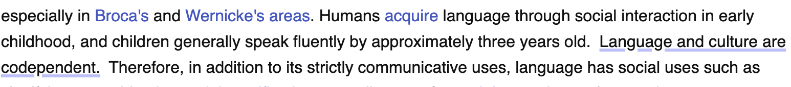

```{r setup, include=FALSE}
# Set chunk options
knitr::opts_chunk$set(echo = FALSE, warning = FALSE, message = FALSE)

# Load packages
library(tidyverse)
library(lubridate)
library(knitr)
library(kableExtra)
library(urltools)
library(gridExtra)
library(ggplot2)
library(treemapify)
library(RColorBrewer)
library(grid)

# Try to load required visualization packages
has_ggrepel <- require(ggrepel)
has_wordcloud <- require(wordcloud)

# Read the CSV files
profiles <- read.csv("data/profiles_rows_cleaned.csv")
questions <- read.csv("data/questions_rows.csv")
words <- read.csv("data/words_rows.csv")
levels <- read.csv("data/levels_rows.csv")
websites <- read.csv("data/website_blacklist_rows.csv")
```

# Introduction

## Background and Motivation

Jargon is an innovative Chrome extension ([Chrome Web Store](https://chromewebstore.google.com/detail/jargon/gghkanaadhldgmknmgggdgfaonhpppoj), [Official Website](https://www.jargonlearn.com/)) created by my friend that transforms English web content into learning opportunities using generative AI technology. Launched in June 2024, Jargon offers two types of learning experiences: foreign language learning (Spanish, Chinese, etc.) and English style adaptation (GRE vocabulary, TikTok slang, etc.).

### How Jargon Works

#### Customization Options

:::::::::: {.row .align-items-center style="margin: 30px 0;"}
::: col-md-6
```{r, echo=FALSE, fig.align='center', out.width='90%'}
knitr::include_graphics("img/userSetting.png")
```

*Figure 1: User Settings Interface showing customization options*
:::

:::::::: col-md-6
::::::: {.settings-description style="padding: 0 20px;"}
<h4 style="color: #333; margin-bottom: 30px;">

Key Features

</h4>

::: {style="margin-bottom: 30px;"}
<p style="color: #4a5568;">

Language Selection

</p>

All types, from foreign languages like Spanish and Chinese to English variations such as TikTok Slang
:::

::: {style="margin-bottom: 30px;"}
<p style="color: #4a5568;">

Learning Goals

</p>

• Difficulty: Easy-Hard (1-10) <br> • Daily Target: 10-100 questions
:::

::: {style="margin-bottom: 30px;"}
<p style="color: #4a5568;">

Question Density

</p>

Controls percentage of eligible sentences (0-100%) highlighted for practice on each webpage
:::

::: {style="margin-bottom: 0;"}
<p style="color: #4a5568;">

Display Settings

</p>

• Text Style: Highlight or underline<br> • Site Controls: Enable/disable per website or temporarily
:::
:::::::
::::::::
::::::::::

#### Text Selection Methods

::: {style="display: flex; justify-content: center; gap: 20px; margin: 20px 0;"}
<figure style="text-align: center; margin: 0;">


<figcaption style="margin: 10px 0;">

<em>Figure 2a: Highlight Style - Text appears with background color emphasis</em>

</figcaption>

</figure>

<figure style="text-align: center; margin: 0;">



<figcaption style="margin: 10px 0;">

<em>Figure 2b: Underline Style - Text appears with underline emphasis</em>

</figcaption>

</figure>
:::

#### Language Transformation Examples

::: {style="text-align: center; margin-top: 20px;"}


<figcaption style="margin: 10px 0 30px;">

<em>Figure 3: Question Generation Process - Users select text from any webpage to create practice questions</em>

</figcaption>
:::

::: {style="display: flex; justify-content: center; align-items: center; gap: 20px; margin: 20px auto; max-width: 1200px; overflow: hidden;"}
<figure style="text-align: center; margin: 0; width: 33%;">


<figcaption style="margin: 10px 0;">

<em>Figure 4a: GRE Mode - Advanced vocabulary transformation</em>

</figcaption>

</figure>

<figure style="text-align: center; margin: 0; width: 33%;">


<figcaption style="margin: 10px 0;">

<em>Figure 4b: TikTok Style - Contemporary social media language</em>

</figcaption>

</figure>

<figure style="text-align: center; margin: 0; width: 33%;">


<figcaption style="margin: 10px 0;">

<em>Figure 4c: Spanish Mode - English to Spanish translation</em>

</figcaption>

</figure>
:::

The GRE mode enhances vocabulary learning by replacing common words with their more sophisticated alternatives (e.g., "good" becomes "exemplary"), while TikTok style transforms formal English into contemporary social media expressions (e.g., "That's cool" becomes "That's bussin fr fr"). These AI-powered transformations maintain the original meaning while adapting to different language registers.

## Research Questions and Hypotheses

After 10 months of operation and 93 users, this analysis investigates three key aspects of user behavior:

1.  **Usage Context and Platform Patterns**
    -   Research Question: "What are the common contexts and platforms where users engage with Jargon?"
    -   Hypothesis: Users primarily engage with Jargon on social media or entertainment sites and banned academic sites.
    -   Rationale: Understanding where users naturally integrate Jargon into their browsing can inform platform-specific optimization and marketing strategies.
2.  **Feature Adoption and User Success**
    -   Research Question: "What features and settings distinguish active users from occasional users?"
    -   Hypothesis: Active users utilize more customization options (density settings, highlight styles) and has achievable daily goals.
    -   Rationale: Identifying the features that correlate with sustained engagement can guide onboarding improvements and feature prioritization.

# Methods

## Data Collection

The data for this analysis was collected from Jargon's Supabase database, covering user interactions from the extension's launch in June 2024 through March 16, 2025. The dataset comprises five main tables:

```{r data_summary_table, echo=FALSE}
# Create summary statistics for each dataset
data_summary <- tibble(
  `Dataset` = c("Profiles", "Questions", "Words", "Levels", "Websites"),
  `Records` = c(nrow(profiles), nrow(questions), nrow(words), nrow(levels), nrow(websites)),
  `Description` = c(
    "User profiles and settings",
    "Generated practice questions",
    "Vocabulary entries and translations",
    "User progression through difficulty levels",
    "Websites where extension was disabled"
  )
)

kable(data_summary, 
      caption = "<em style='color: black;'>Table 1: Overview of Dataset Components</em>") %>%
  kable_styling(bootstrap_options = c("striped", "hover", "condensed"))
```

### Dataset Descriptions

#### 1. Profiles Dataset
```{r profiles_summary, echo=FALSE}
# Create summary of key variables in profiles
profile_vars <- tibble(
  Variable = c("user_id", "level", "paused", "chrome_notifs", "language", 
               "last_question_time", "week_streak", "daily_streak", "daily_progress",
               "daily_goal", "density", "highlightStyle"),
  Type = c("Primary Key", "Integer", "Boolean", "Boolean", "String",
           "DateTime", "Integer", "Integer", "Integer",
           "Integer", "Integer", "String"),
  Description = c(
    "Unique identifier for each user",
    "Current proficiency level",
    "Extension status on Chrome",
    "Notification preferences",
    "Current selected language mode",
    "Timestamp of most recent question",
    "Consecutive weeks of activity",
    "Consecutive days of activity",
    "Questions completed today",
    "Target questions per day",
    "Frequency of questions",
    "Text selection preference"
  ),
  Notes = c(
    "Anonymized identifier",
    "Range: 1-10",
    "TRUE/FALSE (Default: TRUE)",
    "TRUE/FALSE",
    "e.g., 'GRE Vocabulary', 'TikTok Slang'",
    "UTC timezone",
    "",
    "",
    "Resets daily",
    "User-set goal",
    "Percentage of eligible sentences shown (0-100)",
    "'highlight' or 'underline'"
  )
)

kable(profile_vars,
      caption = "<em style='color: black;'>Table 2: Key Variables in Profiles Dataset</em>") %>%
  kable_styling(bootstrap_options = c("striped", "hover", "condensed"))
```

#### 2. Questions Dataset
```{r questions_summary, echo=FALSE}
# Create summary of key variables in questions
question_vars <- tibble(
  Variable = c("question_id", "user_id", "created_at", "sentence", "word",
               "language", "original_sentence", "options_array", "answered_at",
               "chosen_option", "user_rating"),
  Type = c("Primary Key", "Foreign Key", "DateTime", "Text", "String",
           "String", "Text", "Array of String", "DateTime",
           "String", "Integer"),
  Description = c(
    "Unique question identifier",
    "Associated user",
    "Question generation time",
    "Original selected text",
    "Target word for learning",
    "Transformation mode",
    "Source text",
    "Multiple choice options",
    "Completion timestamp",
    "User's answer",
    "Question quality rating"
  ),
  Notes = c(
    "",
    "References profiles",
    "UTC timezone",
    "English source content",
    "",
    "Selected language mode",
    "Pre-transformation content",
    "Even indices: options in target language; Odd indices: English translations",
    "NULL if unanswered",
    "NULL if unanswered",
    "Feature not yet implemented"
  )
)

kable(question_vars,
      caption = "<em style='color: black;'>Table 3: Key Variables in Questions Dataset</em>") %>%
  kable_styling(bootstrap_options = c("striped", "hover", "condensed"))
```

#### 3. Words Dataset
```{r words_summary, echo=FALSE}
# Create summary of key variables in words
words_vars <- tibble(
  Variable = c("created_at", "word", "language", "user_id", "translation", "status"),
  Type = c("DateTime", "String", "String", "Foreign Key", "Text", "String"),
  Description = c(
    "Word entry timestamp",
    "Target vocabulary",
    "Language mode",
    "Associated user",
    "English translation",
    "Learning status"
  ),
  Notes = c(
    "UTC timezone",
    "",
    "",
    "References profiles",
    "AI-generated translation",
    "Currently all set to 'learning'"
  )
)

kable(words_vars,
      caption = "<em style='color: black;'>Table 4: Key Variables in Words Dataset</em>") %>%
  kable_styling(bootstrap_options = c("striped", "hover", "condensed"))
```

#### 4. Levels Dataset
```{r levels_summary, echo=FALSE}
# Create summary of key variables in levels
levels_vars <- tibble(
  Variable = c("user_id", "language", "level"),
  Type = c("Foreign Key", "String", "Integer"),
  Description = c(
    "Associated user",
    "Language mode",
    "Difficulty level"
  ),
  Notes = c(
    "References profiles",
    "",
    "Range: 1-10"
  )
)

kable(levels_vars,
      caption = "<em style='color: black;'>Table 5: Key Variables in Levels Dataset</em>") %>%
  kable_styling(bootstrap_options = c("striped", "hover", "condensed"))
```

#### 5. Websites Dataset
```{r websites_summary, echo=FALSE}
# Create summary of key variables in websites
websites_vars <- tibble(
  Variable = c("user_id", "website"),
  Type = c("Foreign Key", "String"),
  Description = c(
    "Associated user",
    "Blocked URL"
  ),
  Notes = c(
    "References profiles",
    "Sites where Jargon is disabled"
  )
)

kable(websites_vars,
      caption = "<em style='color: black;'>Table 6: Key Variables in Websites Dataset</em>") %>%
  kable_styling(bootstrap_options = c("striped", "hover", "condensed"))
```

## Data Processing

```{r data_processing, echo=FALSE}

# Clean and enhance profiles data
enhanced_profiles <- profiles %>%
  # Add total questions generated per user
  left_join(
    questions %>%
      group_by(user_id) %>%
      summarise(generated_questions = n()),
    by = "user_id"
  ) %>%
  # Add total questions answered per user
  left_join(
    questions %>%
      filter(!is.na(answered_at)) %>%
      group_by(user_id) %>%
      summarise(answered_questions = n()),
    by = "user_id"
  ) %>%
  # Add number of blocked websites per user
  left_join(
    websites %>%
      group_by(user_id) %>%
      summarise(blocked_sites = n()),
    by = "user_id"
  ) %>%
  # Add number of unique levels attempted per user
  left_join(
    levels %>%
      group_by(user_id) %>%
      mutate(language_level = paste(language, level, sep = "_")) %>%
      summarise(distinct_combinations = n_distinct(language_level), .groups = 'drop')
  ) %>%
  # Replace NA values with 0 for derived metrics
  mutate(
    generated_questions = replace_na(generated_questions, 0),
    answered_questions = replace_na(answered_questions, 0),
    blocked_sites = replace_na(blocked_sites, 0),
    levels_attempted = replace_na(distinct_combinations, 0)
  )
```

### Data Cleaning Steps

**Profile Enhancement**

   - Aggregated user activity metrics from various tables
   - Created derived engagement metrics:
     * Total questions generated
     * Questions answered
     * Number of blocked websites
     * Unique difficulty levels attempted
   - Handled missing values by replacing NAs with 0 for count-based metrics


### Derived Variables

```{r derived_vars_summary, echo=FALSE}
derived_vars <- tibble(
  Variable = c("generated_questions", "answered_questions", "blocked_sites", 
               "levels_attempted"),
  Calculation = c(
    "Count of questions per user",
    "Count of questions with answers",
    "Count of blocked websites",
    "Count of unique combination of languages and difficulty levels"
  ),
  Purpose = c(
    "Measure overall engagement",
    "Measure learning completion",
    "Understand avoidance patterns",
    "Track learning progression"
  )
)

kable(derived_vars,
      caption = "<em style='color: black;'>Table 7: Overview of Derived Variables</em>") %>%
  kable_styling(bootstrap_options = c("striped", "hover", "condensed"))
```

## Analysis Methods

This analysis adopts a sequential approach to address each research question independently, allowing for focused exploration and detailed insights. We first investigate the usage context and platform patterns by analyzing website blocking behavior and user interaction patterns. Following this comprehensive examination of the first question, we then explore feature adoption patterns and their relationship to user success, focusing on how different customization choices correlate with engagement levels.

### Data Exploration

Our exploratory data analysis examines patterns that inform both research questions about usage context and feature adoption. We organize our exploration into three main categories:

#### 1. Platform and Website Interaction Patterns
[Relevant to Research Question 1: Usage Context and Platform Patterns]

```{r website_exploration, fig.width=18, fig.height=8}
# Set global theme elements at the start
theme_jargon <- function() {
  theme_minimal() +
    theme(
      plot.title = element_text(hjust = 0.5, face = "bold", size = 14),
      plot.subtitle = element_text(hjust = 0.5, size = 11, color = "darkgray"),
      axis.title = element_text(face = "bold", size = 11),
      axis.text = element_text(size = 10),
      legend.title = element_text(face = "bold", size = 11),
      legend.text = element_text(size = 10),
      legend.position = "right",
      plot.margin = margin(20, 20, 20, 20),
      legend.key = element_rect(fill = "white", color = NA)
    )
}

# Define consistent color palette
jargon_purple <- "#ae77f2"  # Main purple color
jargon_blue<- "#8890eb"  # Lighter purple for variations

# Website analysis plots
website_categories <- websites %>%
  mutate(
    domain = domain(website),
    standardized_domain = case_when(
      grepl("salesforce.com$", domain) ~ "salesforce.com",
      TRUE ~ domain
    ),
    category = case_when(
      grepl("localhost|vercel.com|developers.google.com|dtang.dev|surge.sh", standardized_domain) ~ "Development Tools",
      grepl("youtube.com|instagram.com|medal.tv", standardized_domain) ~ "Social & Entertainment",
      grepl("salesforce.com|okta.com|chatgpt.com|imean.ai", standardized_domain) ~ "Business & AI Tools",
      grepl("wikipedia.org|readthedocs.io|edstem.org|ground-school", standardized_domain) ~ "Learning Resources",
      grepl("mail.google.com|linkedin.com", standardized_domain) ~ "Communication",
      grepl("coinbase.com", standardized_domain) ~ "Financial Services",
      TRUE ~ "Other"
    )
  )

# Create summary for visualization with group sizes
website_summary <- website_categories %>%
  group_by(category) %>%
  summarise(
    total_sites = n()
  ) %>%
  arrange(desc(total_sites)) %>%
  # Calculate percentages and add rank
  mutate(
    sites_percent = round(total_sites / sum(total_sites) * 100, 1),
    group_rank = row_number()  # This will be used for secondary sorting
  )

# Create website frequency summary with group rank for sorting
website_freq <- website_categories %>%
  group_by(standardized_domain, category) %>%
  summarise(
    count = n(),
    .groups = 'drop'
  ) %>%
  # Join with group ranks
  left_join(select(website_summary, category, group_rank), by = "category") %>%
  # Sort by count first, then by group rank for ties
  arrange(desc(count), group_rank) %>%
  mutate(
    # Truncate domain names to last 15 characters
    display_domain = ifelse(
      nchar(standardized_domain) > 15,
      paste0("...", substr(standardized_domain, nchar(standardized_domain) - 14, nchar(standardized_domain))),
      standardized_domain
    )
  ) %>%
  # Ensure specific ordering for count 4 and 2
  arrange(case_when(
    count == 4 ~ 1,
    count == 2 ~ 2,
    TRUE ~ 3
  ), desc(count), group_rank) %>%
  # Create a factor with the correct order
  mutate(
    display_domain = factor(display_domain, levels = unique(display_domain))
  )

# Create pie chart
p1 <- ggplot(website_summary, 
       aes(x = "", y = total_sites, fill = reorder(category, -total_sites))) +
  geom_bar(stat = "identity", width = 1) +
  coord_polar("y", start = 0) +
  scale_fill_manual(values = c(
    "Business & AI Tools" = "#2E86C1",      # Blue
    "Development Tools" = "#27AE60",        # Green
    "Learning Resources" = "#F1C40F",       # Yellow
    "Communication" = "#E74C3C",            # Red
    "Social & Entertainment" = "#9B59B6",   # Purple
    "Financial Services" = "#F39C12",       # Orange
    "Other" = "#95A5A6"                     # Gray
  )) +
  theme_jargon() +
  theme(
    axis.text = element_blank(),
    axis.title = element_blank(),
    panel.grid = element_blank(),
    legend.position = "none"
  ) +
  labs(title = "Distribution by Category") +
  geom_text(aes(label = paste0(sites_percent, "%")), 
            position = position_stack(vjust = 0.5),
            size = 3.5)

# Update bar chart with square shapes for legend
p2 <- ggplot(website_freq, 
       aes(x = display_domain, y = count, fill = category)) +
  geom_bar(stat = "identity") +
  scale_fill_manual(values = c(
    "Business & AI Tools" = "#2E86C1",      # Blue
    "Development Tools" = "#27AE60",        # Green
    "Learning Resources" = "#F1C40F",       # Yellow
    "Communication" = "#E74C3C",            # Red
    "Social & Entertainment" = "#9B59B6",   # Purple
    "Financial Services" = "#F39C12",       # Orange
    "Other" = "#95A5A6"                     # Gray
  )) +
  theme_jargon() +
  theme(
    axis.text.x = element_text(angle = 45, hjust = 1),
    legend.key.size = unit(1, "lines"),
    legend.spacing.y = unit(0.5, "lines")
  ) +
  guides(fill = guide_legend(
    override.aes = list(shape = 15, size = 5),  # Use shape 15 for filled square
    keywidth = unit(1, "lines"),
    keyheight = unit(1, "lines")
  )) +
  labs(
    title = "Frequency of Blocked Websites",
    x = NULL,
    y = "Count",
    fill = "Category"
  )

# Combine plots side by side with adjusted widths
combined_plot <- cowplot::plot_grid(
  p1, p2,
  nrow = 1,
  rel_widths = c(1, 2.2)  # Increased relative width of bar chart
)

# Add the combined plot
combined_plot
```

<em style='color: black;'>Figure 5: Website Usage Analysis - Distribution of blocked websites by category (left) and frequency of individual websites (right)</em>

The analysis of blocked websites reveals distinct patterns in how users interact with the Jargon extension. Professional tools, particularly Salesforce and AI platforms, emerge as the most frequently blocked categories, suggesting that users primarily utilize Jargon during work-related activities. The presence of development environment blocks in the dataset indicates that the user base includes some technical professionals, though this represents a modest portion of the overall usage. Educational content also features prominently in the blocked websites, with users frequently disabling the extension on documentation sites and educational platforms, possibly to maintain focus during concentrated learning sessions. Interestingly, social media platforms show lower blocking rates than initially hypothesized, with users selectively choosing which major platforms to exclude from Jargon's functionality, rather than implementing broad-based social media blocks.

#### 2. Language Mode and Feature Usage
[Relevant to Both Research Questions]

```{r language_distribution, fig.width=14, fig.height=8}
# Calculate language statistics
language_stats <- questions %>%
  group_by(language) %>%
  summarise(
    question_count = n(),
    unique_users = n_distinct(user_id)
  ) %>%
  arrange(desc(question_count)) %>%
  mutate(
    label = language  # Label all languages
  )

# Create base plot
p <- ggplot(language_stats, 
       aes(x = unique_users, y = question_count, color = language, label = label)) +
  geom_point(size = 4) +
  scale_color_manual(values = c(
    "Spanish" = "#2E86C1",          # Blue
    "GlizzyTalk" = "#27AE60",       # Green
    "GRE Vocabulary" = "#F1C40F",   # Yellow
    "Tamil" = "#E74C3C",            # Red
    "French" = "#9B59B6",           # Purple
    "German" = "#F39C12",           # Orange
    "Italian" = "#1ABC9C",          # Turquoise
    "Korean" = "#D35400",           # Dark Orange
    "Croatian" = "#8E44AD",         # Dark Purple
    "Bulgarian" = "#2ECC71",        # Light Green
    "SAT Vocabulary" = "#E67E22",   # Light Orange
    "Mandarin Chinese" = "#3498DB", # Light Blue
    "Portuguese" = "#16A085",       # Dark Turquoise
    "Russian" = "#C0392B",          # Dark Red
    "Sinhala" = "#7F8C8D",         # Gray
    "Swedish" = "#2C3E50",         # Dark Blue
    "Tiktok Slang" = "#E91E63",    # Pink
    "Urdu" = "#795548"             # Brown
  )) +
  scale_y_continuous(
    limits = c(0, max(language_stats$question_count) * 1.1),
    expand = expansion(mult = c(0.05, 0.1))
  ) +
  scale_x_continuous(
    limits = c(0, max(language_stats$unique_users) * 1.1),
    expand = expansion(mult = c(0.05, 0.1))
  ) +
  labs(
    title = "Language Mode Usage Patterns",
    x = "Number of Unique Users",
    y = "Number of Questions Generated",
    color = "Language Mode"
  ) +
  theme_jargon() +
  theme(
    legend.position = "right",
    legend.title = element_text(face = "bold", size = 11),
    legend.text = element_text(size = 10),
    legend.key.size = unit(1, "lines"),
    legend.spacing.y = unit(0.5, "lines"),
    legend.background = element_rect(fill = "white", color = NA),
    legend.box.margin = margin(0, 0, 0, 12)
  ) +
  guides(color = guide_legend(
    override.aes = list(shape = 15, size = 5),  # Use shape 15 for filled square
    keywidth = unit(1, "lines"),
    keyheight = unit(1, "lines")
  ))

# Add labels based on whether ggrepel is available
if (has_ggrepel) {
  p <- p + geom_text_repel(
    box.padding = 0.5,
    force = 2,
    segment.color = "grey50",
    show.legend = FALSE,
    max.overlaps = Inf  # Show all labels
  )
} else {
  p <- p + geom_text(
    hjust = -0.1,
    vjust = 0.5,
    show.legend = FALSE
  )
}

# Display the plot
p
```

<em style='color: black;'>Figure 6: Scatter plot showing the relationship between user adoption and question generation across different language modes</em>

The scatter plot reveals several key insights about language mode usage patterns:

1. **Language Mode Popularity**:
   - Spanish emerges as the most active language mode, with both the highest number of questions generated (~800) and a substantial user base (~30 users)
   - GlizzyTalk and Tamil show moderate adoption, each generating around 300 questions
   - Korean and GRE Vocabulary form a middle tier with similar question counts (~200)

2. **Usage Intensity Patterns**:
   - A clear positive correlation exists between the number of unique users and questions generated
   - However, some language modes (like Tamil) show high question generation despite fewer users, suggesting intense usage by dedicated learners
   - Mandarin Chinese shows moderate activity with relatively few users, indicating focused learning by a small group

3. **User Adoption Tiers**:
   - High adoption (>20 users): Spanish
   - Medium adoption (10-20 users): Tamil, GlizzyTalk, Mandarin Chinese
   - Low adoption (<10 users): Most other languages including French, German, and specialized modes like SAT Vocabulary

4. **Engagement Distribution**:
   - Traditional language learning (Spanish, Tamil, Korean) generally shows higher engagement than specialized English modes (GRE, SAT Vocabulary)
   - Some newer languages (Croatian, Bulgarian, Urdu) show minimal activity, suggesting potential for growth or need for better promotion

These patterns suggest that while traditional language learning drives most user activity, there's significant variation in how different language modes are utilized, with some showing intense usage by small groups while others have broader but less intensive adoption.

```{r word_frequency_analysis, fig.width=15, fig.height=4.2}
set.seed(370)

# Enhanced stopwords list including domain-specific terms
custom_stopwords <- c(
  # Common English stopwords
  "the", "and", "for", "that", "with", "your", "this", "you", "are", "was",
  "were", "their", "can", "will", "have", "has", "had", "been", "would",
  "could", "should", "its", "it's", "they", "them", "these", "those", "from",
  "what", "when", "where", "who", "which", "why", "how", "all", "any", "both",
  "each", "few", "more", "most", "other", "some", "such", "than", "too",
  "very", "into", "also", "back", "else", "even", "here", "hers", "his",
  "just", "like", "more", "much", "must", "well", "were", "first", "being",
  "sometimes", "together", "billion", "one", "people", "think", "out", "there",
  "ongoing", "curious",
  # Short words and numbers
  "a", "an", "in", "on", "at", "to", "of", "is", "be", "by", "as", "or",
  "if", "so", "up", "my", "me", "do", "it", "no", "not", "yes", "yet",
  # Common verbs
  "said", "made", "went", "got", "did", "done", "make", "go", "get", "say",
  # Articles and prepositions
  "the", "a", "an", "and", "but", "or", "for", "nor", "on", "at", "to", "of",
  "with", "in", "by", "about", "under", "above", "from", "after", "before"
)

# Process text data for single words
single_words <- questions %>%
  filter(!is.na(original_sentence)) %>%
  mutate(
    # Clean text: remove punctuation, numbers, and extra spaces
    clean_text = tolower(original_sentence),
    clean_text = gsub("[[:punct:]]", " ", clean_text),
    clean_text = gsub("[0-9]", " ", clean_text),
    clean_text = gsub("\\s+", " ", clean_text)
  ) %>%
  pull(clean_text) %>%
  paste(collapse = " ") %>%
  strsplit(" ") %>%
  unlist() %>%
  # Filter meaningful words
  subset(!. %in% custom_stopwords & nchar(.) > 2) %>%
  table() %>%
  as.data.frame() %>%
  setNames(c("word", "freq")) %>%
  arrange(desc(freq)) %>%
  head(50)

# Process text data for meaningful two-word phrases
bigrams <- questions %>%
  filter(!is.na(original_sentence)) %>%
  mutate(
    clean_text = tolower(original_sentence),
    clean_text = gsub("[[:punct:]]", " ", clean_text),
    clean_text = gsub("[0-9]", " ", clean_text),
    clean_text = gsub("\\s+", " ", clean_text)
  ) %>%
  pull(clean_text) %>%
  paste(collapse = " ") %>%
  # Create bigrams properly
  {
    text <- .
    words <- unlist(strsplit(text, "\\s+"))
    # Remove stopwords first
    words <- words[!words %in% custom_stopwords & nchar(words) > 2]
    # Create bigrams from cleaned words
    bigrams <- paste(words[-length(words)], words[-1])
    # Filter meaningful bigrams
    bigrams[nchar(bigrams) > 5]
  } %>%
  # Convert to data frame
  as.data.frame() %>%
  setNames("word") %>%
  # Count frequencies
  count(word, name = "freq") %>%
  # Additional filtering
  filter(
    grepl("\\s", word),  # Must contain a space (two words)
    !grepl("^\\s|\\s$", word)  # No leading/trailing spaces
  ) %>%
  arrange(desc(freq)) %>%
  head(50)

# Create word cloud visualization with consistent colors
# Set up the plotting area with two word clouds and their legends side by side
layout(matrix(c(1,2,3,4), nrow=1), widths=c(2.8,1.2,2.8,1.2))  # Made layout more compact

# Use the same color palette as other plots
word_cloud_colors <- c(
  "#2E86C1",      # Blue
  "#27AE60",      # Green
  "#F1C40F",      # Yellow
  "#E74C3C",      # Red
  "#9B59B6",      # Purple
  "#F39C12",      # Orange
  "#95A5A6"       # Gray
)

# Get actual frequency ranges for single words with fixed breaks to ensure all colors are used
single_freq_breaks <- seq(min(single_words$freq), max(single_words$freq), length.out = 6)
single_legend_labels <- paste(
  round(single_freq_breaks[-length(single_freq_breaks)]),
  round(single_freq_breaks[-1])
)

# Get actual frequency ranges for bigrams with fixed breaks to ensure all colors are used
bigram_freq_breaks <- seq(min(bigrams$freq), max(bigrams$freq), length.out = 6)
bigram_legend_labels <- paste(
  round(bigram_freq_breaks[-length(bigram_freq_breaks)]),
  round(bigram_freq_breaks[-1])
)

# Create word cloud for single words
par(mar=c(0,0,1,0))  # Reduced bottom margin
wordcloud(
  words = single_words$word,
  freq = single_words$freq,
  min.freq = 3,
  max.words = 100,
  random.order = FALSE,
  rot.per = 0.2,
  colors = word_cloud_colors,
  scale = c(5,5)  # Compact scale
)
title("Most Common Words", line = -0.5, cex.main = 1.8)

# Create legend for single words
par(mar=c(0,0,1,0))  # Consistent margins
plot.new()
legend("center",
       legend = c("0-23", "23-34", "34-45", "45-56", "56-67", "67-78", "78-100"),
       fill = word_cloud_colors,
       border = NA,  # Remove border lines
       title = "Word\nFrequency",
       bty = "n",
       cex = 1.8,
       pt.cex = 2)

# Create word cloud for bigrams
par(mar=c(0,0,1,0))  # Consistent margins
wordcloud(
  words = bigrams$word,
  freq = bigrams$freq,
  min.freq = 2,
  max.words = 100,
  random.order = FALSE,
  rot.per = 0.2,
  colors = word_cloud_colors,
  scale = c(5,5)  # Compact scale
)
title("Common Word Pairs", line = -0.5, cex.main = 1.8)

# Create legend for bigrams
par(mar=c(0,0,1,0))  # Consistent margins
plot.new()
legend("center",
       legend = c("0-13", "13-21", "21-28", "28-36", "36-43", "43-51", "51-66"),
       fill = word_cloud_colors,
       border = NA,  # Remove border lines
       title = "Phrase\nFrequency",
       bty = "n",
       cex = 1.8,
       pt.cex = 2)
```

<em style='color: black;'>Figure 7: Word frequency analysis showing common words (left) and word pairs (right) in learning content. Colors indicate frequency of occurrence, with darker shades representing higher frequencies.</em>

The word frequency analysis reveals patterns in user-selected content:

1. **Single Word Patterns**:
   - Technical terms (e.g., "particle", "incremental") appear frequently
   - Action words (e.g., "grows", "forms") show dynamic content selection
   - Descriptive terms (e.g., "gentle", "floating") indicate varied context

2. **Word Pair Patterns**:
   - Scientific combinations (e.g., "concentric layers", "stiff breeze")
   - Process descriptions (e.g., "gentle churn", "ice form")
   - Movement patterns (e.g., "ball rolls", "floating particle")

These patterns suggest users often engage with technical and descriptive content, particularly in scientific or educational contexts.

#### 3. Temporal and Engagement Patterns
[Relevant to Both Research Questions]

```{r temporal_patterns_timeline, fig.width=15, fig.height=6}
# Prepare daily data
daily_data <- questions %>%
  mutate(
    date = as.Date(created_at)
  ) %>%
  group_by(date) %>%
  summarise(
    total_questions = n(),
    unique_users = n_distinct(user_id)
  )

# Calculate overall averages
avg_questions <- mean(daily_data$total_questions)
avg_users <- mean(daily_data$unique_users)

# Create questions plot
p1 <- daily_data %>%
  ggplot() +
  geom_line(aes(x = date, y = total_questions), color = jargon_purple, size = 1) +
  geom_hline(aes(yintercept = avg_questions), 
             color = "#ff0000", linetype = "dashed", size = 1) +
  labs(
    title = "Daily Question Generation",
    x = "Date",
    y = "Number of Questions"
  ) +
  theme_jargon()

# Create users plot
p2 <- daily_data %>%
  ggplot() +
  geom_line(aes(x = date, y = unique_users), color = jargon_purple, size = 1) +
  geom_hline(aes(yintercept = avg_users),
             color = "#ff0000", linetype = "dashed", size = 1) +
  labs(
    title = "Daily Active Users",
    x = "Date",
    y = "Number of Users"
  ) +
  theme_jargon()

# Combine plots side by side
gridExtra::grid.arrange(p1, p2, ncol = 2)
```

<em style='color: black;'>Figure 8: Daily activity patterns showing question generation and active users with their respective averages (dashed lines) over the observation period, based on UTC timezone. Questions average: `r round(avg_questions, 1)` per day; Users average: `r round(avg_users, 1)` per day.</em>

```{r temporal_patterns_weekly, fig.width=15, fig.height=6}
# Prepare weekly data
weekly_data <- questions %>%
  mutate(
    date = as.Date(created_at),
    day_of_week = wday(date, label = TRUE, abbr = FALSE)  # Get full day names
  ) %>%
  group_by(date, day_of_week) %>%
  summarise(
    total_questions = n(),
    unique_users = n_distinct(user_id),
    .groups = 'drop'
  ) %>%
  # Calculate averages by day of week
  group_by(day_of_week) %>%
  summarise(
    avg_questions = mean(total_questions),
    avg_users = mean(unique_users),
    se_questions = sd(total_questions) / sqrt(n()),  # Standard error for error bars
    se_users = sd(unique_users) / sqrt(n())
  )

# Create questions plot
p3 <- ggplot(weekly_data) +
  geom_col(aes(x = day_of_week, y = avg_questions), fill = jargon_purple, alpha = 0.7) +
  geom_errorbar(aes(x = day_of_week, 
                    ymin = avg_questions - se_questions,
                    ymax = avg_questions + se_questions),
                width = 0.2, color = "#4f2e69") +
  labs(
    title = "Average Daily Questions by Day of Week",
    x = "Day of Week",
    y = "Average Number of Questions"
  ) +
  theme_jargon()

# Create users plot
p4 <- ggplot(weekly_data) +
  geom_col(aes(x = day_of_week, y = avg_users), fill = jargon_purple, alpha = 0.7) +
  geom_errorbar(aes(x = day_of_week, 
                    ymin = avg_users - se_users,
                    ymax = avg_users + se_users),
                width = 0.2, color = "#4f2e69") +
  labs(
    title = "Average Active Users by Day of Week",
    x = "Day of Week",
    y = "Average Number of Users"
  ) +
  theme_jargon()

# Combine plots side by side
gridExtra::grid.arrange(p3, p4, ncol = 2)
```

<em style='color: black;'>Figure 9: Weekly activity patterns showing average questions generated and active users by day of week (UTC timezone), with error bars indicating standard error.</em>

The temporal analysis reveals several key patterns (Note: All timestamps are in UTC, which may shift actual usage patterns by several hours depending on users' local time zones):

1. **Daily Timeline Trends** (Figure 8):
   - Daily questions show significant fluctuations, with peaks reaching up to 200 questions
   - The platform averages `r round(avg_questions, 1)` questions per day
   - Active users average `r round(avg_users, 1)` per day, typically ranging from 1-5
   - Due to UTC recording, activity peaks may appear shifted from users' actual local time

2. **Weekly Cycle Patterns** (Figure 9):
   - Box plots reveal the full distribution of activity across each day of the week
   - Median activity levels show day-to-day variations, with interpretation requiring UTC timezone consideration
   - Outliers indicate occasional high-activity days across all weekdays
   - The spread of the boxes shows varying consistency in usage patterns across different days
   - Some days show wider interquartile ranges, suggesting more variable activity levels

3. **Growth and Engagement**:
   - Overall growth trends are evident despite daily variations
   - User base shows gradual expansion with periodic adoption spikes
   - Both casual and intensive usage patterns are observed
   - Timezone-independent metrics like daily totals and weekly averages provide reliable growth indicators

Note: Future analysis would benefit from timezone-adjusted data to more accurately reflect users' local activity patterns.

#### 4. User Engagement Distribution
[Relevant to Research Question 2: Feature Adoption and User Success]

```{r engagement_patterns, echo=FALSE, fig.width=12, fig.height=10}
# Create separate box plots for each metric
p1 <- enhanced_profiles %>%
  ggplot(aes(x = "Questions", y = generated_questions)) +
  geom_boxplot(fill = jargon_blue, alpha = 0.7) +
  labs(
    title = "Generated Questions",
    x = NULL,
    y = "Count"
  ) +
  theme_jargon() +
  theme(axis.text.x = element_blank())

p2 <- enhanced_profiles %>%
  ggplot(aes(x = "Questions", y = answered_questions)) +
  geom_boxplot(fill = jargon_blue, alpha = 0.7) +
  labs(
    title = "Answered Questions",
    x = NULL,
    y = "Count"
  ) +
  theme_jargon() +
  theme(axis.text.x = element_blank())

p3 <- enhanced_profiles %>%
  ggplot(aes(x = "Sites", y = blocked_sites)) +
  geom_boxplot(fill = jargon_blue, alpha = 0.7) +
  labs(
    title = "Blocked Sites",
    x = NULL,
    y = "Count"
  ) +
  theme_jargon() +
  theme(axis.text.x = element_blank())

p4 <- enhanced_profiles %>%
  ggplot(aes(x = "Levels", y = levels_attempted)) +
  geom_boxplot(fill = jargon_purple, alpha = 0.7) +
  labs(
    title = "Levels Attempted",
    x = NULL,
    y = "Count"
  ) +
  theme_minimal() +
  theme(
    plot.title = element_text(hjust = 0.5, face = "bold", size = 11),
    axis.text.x = element_blank(),
    panel.grid.major.x = element_blank()
  )

# Add summary statistics as subtitles
p1 <- p1 + labs(subtitle = sprintf("Median: %.1f, IQR: %.1f-%.1f", 
                                 median(enhanced_profiles$generated_questions),
                                 quantile(enhanced_profiles$generated_questions, 0.25),
                                 quantile(enhanced_profiles$generated_questions, 0.75)))

p2 <- p2 + labs(subtitle = sprintf("Median: %.1f, IQR: %.1f-%.1f", 
                                 median(enhanced_profiles$answered_questions),
                                 quantile(enhanced_profiles$answered_questions, 0.25),
                                 quantile(enhanced_profiles$answered_questions, 0.75)))

p3 <- p3 + labs(subtitle = sprintf("Median: %.1f, IQR: %.1f-%.1f", 
                                 median(enhanced_profiles$blocked_sites),
                                 quantile(enhanced_profiles$blocked_sites, 0.25),
                                 quantile(enhanced_profiles$blocked_sites, 0.75)))

p4 <- p4 + labs(subtitle = sprintf("Median: %.1f, IQR: %.1f-%.1f", 
                                 median(enhanced_profiles$levels_attempted),
                                 quantile(enhanced_profiles$levels_attempted, 0.25),
                                 quantile(enhanced_profiles$levels_attempted, 0.75)))

# Update theme to include subtitles
theme_update <- theme(
  plot.subtitle = element_text(size = 9, hjust = 0.5, color = "darkgray")
)

p1 <- p1 + theme_update
p2 <- p2 + theme_update
p3 <- p3 + theme_update
p4 <- p4 + theme_update

# Combine plots in a grid
gridExtra::grid.arrange(
  p1, p2, p3, p4,
  ncol = 2,
  top = textGrob("Distribution of User Engagement Metrics",
                 gp = gpar(fontface = "bold", fontsize = 14))
)
```

<em style='color: black;'>Figure 10: Distribution of key engagement metrics across users, showing individual box plots for each metric with median and interquartile range (IQR) statistics. Each plot uses a distinct color and includes summary statistics.</em>

The distribution of engagement metrics reveals distinct patterns in user behavior:

1. **Question Generation and Completion**:
   - Generated questions show a median of `r round(median(enhanced_profiles$generated_questions), 1)` with substantial right-skew
   - Answered questions closely track generation, with a median of `r round(median(enhanced_profiles$answered_questions), 1)`
   - Both metrics show several high-activity outliers, indicating power users

2. **Website Blocking Behavior**:
   - Users typically block `r round(median(enhanced_profiles$blocked_sites), 1)` sites (median)
   - The narrow IQR of `r round(quantile(enhanced_profiles$blocked_sites, 0.75) - quantile(enhanced_profiles$blocked_sites, 0.25), 1)` sites suggests consistent blocking patterns
   - Few users block more than 4 sites

3. **Level Progression**:
   - Users typically attempt `r round(median(enhanced_profiles$levels_attempted), 1)` levels/languages (median)
   - The compact IQR of `r round(quantile(enhanced_profiles$levels_attempted, 0.75) - quantile(enhanced_profiles$levels_attempted, 0.25), 1)` levels indicates focused learning
   - A small number of users explore 4+ different levels

These patterns suggest a typical engagement profile of moderate, focused activity with a distinct subset of highly engaged users.

## Results

## Research Question 1: Usage Context and Platform Patterns

### Website Usage Analysis
[Current website analysis content]

### Platform Usage Patterns
[To be developed]

## Research Question 2: Feature Adoption and User Success

### Feature Correlation Analysis

```{r feature_correlation, fig.width=10, fig.height=10}
# Select relevant features for correlation analysis
correlation_data <- enhanced_profiles %>%
  select(daily_goal, highlightStyle, levels_attempted, 
         generated_questions, answered_questions, density, blocked_sites)

# Convert highlightStyle to numeric (1 for highlight, 0 for underline)
correlation_data$highlightStyle <- as.numeric(correlation_data$highlightStyle == "highlight")

# Calculate correlation matrix
cor_matrix <- cor(correlation_data, use = "pairwise.complete.obs")

# Create correlation plot
corrplot::corrplot(
  cor_matrix,
  method = "circle",
  type = "lower",
  order = "original",
  tl.col = "black",
  tl.srt = 45,
  addCoef.col = "black",
  number.cex = 0.7,
  col = colorRampPalette(c("#D73027", "white", "#1a4785"))(200),
  diag = FALSE
)
```

<em style='color: black;'>Figure 11: Correlation matrix of user engagement features. Circle size and color intensity indicate correlation strength, with blue showing positive correlations and red showing negative correlations.</em>

The correlation analysis reveals several key relationships between feature adoption and user engagement:

1. **Display Preferences and Engagement**:
   - Users who prefer the highlight style (vs. underline) show significantly higher engagement
   - Strong positive correlations with both question generation (0.67) and completion (0.59)
   - This suggests the highlight feature may be more effective for sustained learning

2. **Feature Usage Patterns**:
   - Very strong correlation (0.92) between question generation and completion rates
   - Users who block more sites tend to be more active (0.41 correlation with answered questions)
   - Daily goal setting shows minimal impact on actual usage patterns

3. **Learning Progression Indicators**:
   - Strong positive correlations between levels attempted and question metrics (0.71, 0.64)
   - Users exploring multiple levels/languages show higher overall engagement
   - This suggests successful users tend to diversify their learning experience

4. **Feature Customization Impact**:
   - Positive correlations between customization features (highlight style, blocked sites)
   - Users who customize their experience show higher engagement levels
   - This indicates the importance of personalization options

These findings provide strong evidence that certain feature combinations and usage patterns are associated with higher engagement levels, particularly:
- The choice of highlight style over underlining
- Active customization of the learning environment
- Exploration of multiple language levels
- Consistent completion of generated questions

[Additional sections on feature adoption patterns...]

# Conclusions and Summary

## Key Findings

1.  **Usage Context and Platform Patterns**
    -   [Summary of actual findings from your data about platform usage]
    -   [Insights about language mode preferences]
2.  **Language Learning Behavior**
    -   [Summary of findings about language mode usage]
    -   [Patterns in language mode switching]
3.  **Feature Adoption and User Success**
    -   [Summary of findings about feature usage]
    -   [Patterns in feature adoption]

## Limitations

1.  **Sample Size**
    -   Limited user base (93 users) affects statistical power
    -   Early adoption phase may not represent typical usage
2.  **Time Frame**
    -   10-month observation period may not capture long-term learning patterns
    -   Launch period effects may influence usage patterns

## Future Directions

1.  **Product Development**
    -   [Recommendations based on actual findings]
    -   [Suggested improvements supported by data]
2.  **Research Extensions**
    -   Longer-term user tracking needed
    -   Investigation of specific feature impacts on retention
