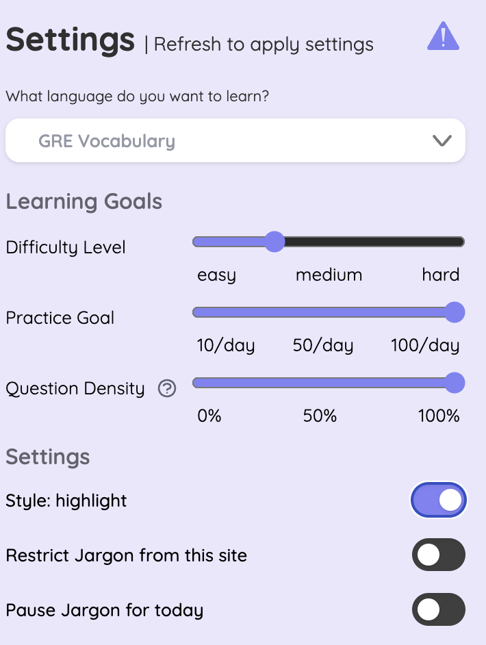
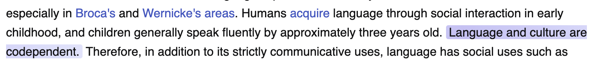
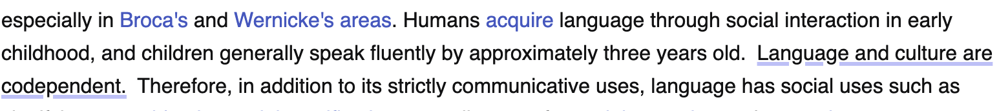
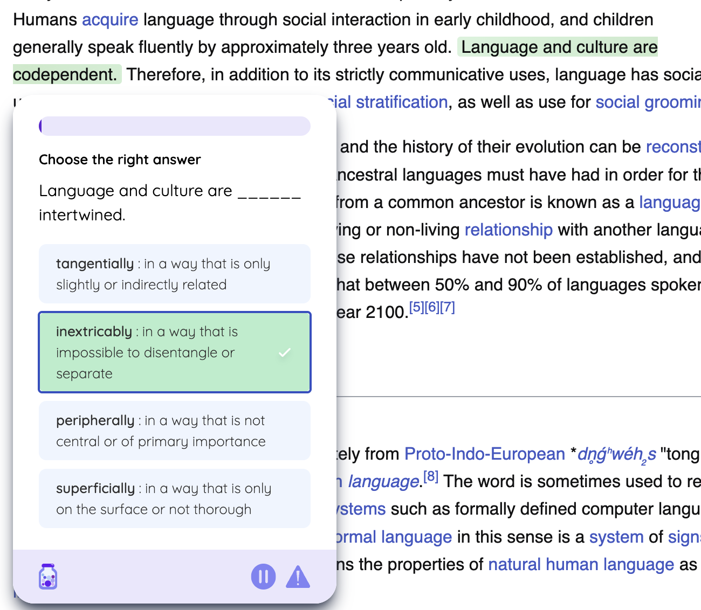
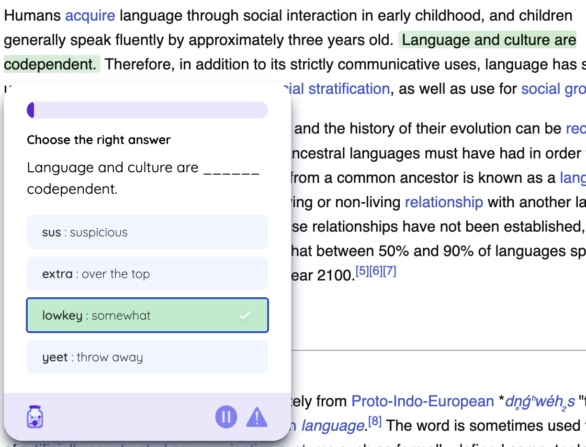
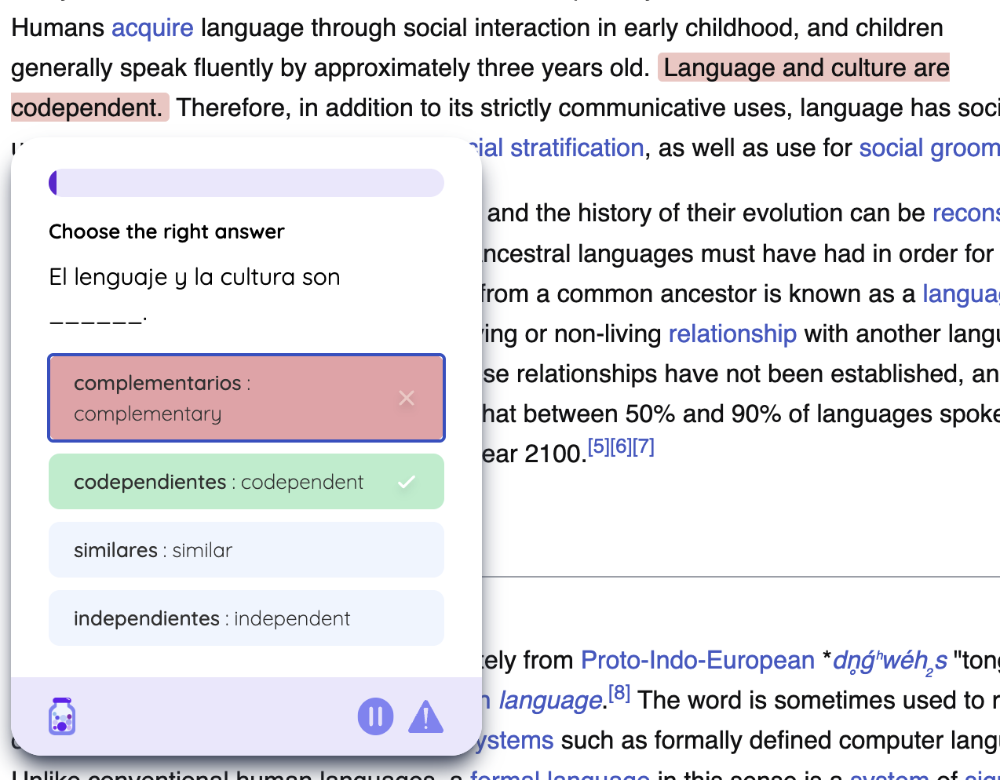

```{=html}
<div class="nav-header">
  <div class="nav-title">Jargon Analytics</div>
  <div class="nav-links">
    <a href="index.html" class="nav-active">Home</a>
    <a href="data_overview.html" class="nav-inactive">Data Overview</a>
    <a href="eda.html" class="nav-inactive">EDA</a>
    <a href="methods.html" class="nav-inactive">Methods</a>
    <a href="results.html" class="nav-inactive">Results</a>
    <a href="conclusions.html" class="nav-inactive">Conclusions</a>
  </div>
</div>
```

# Introduction
```{=html}
<iframe src="https://drive.google.com/file/d/1znOqHIaAsB1tQk7CutbS2I1zb-M2QEyq/view?usp=sharing" width="640" height="480"></iframe>
```
Click to view the video presentation. Scroll down to download the report PDF.

## Background and Motivation

Jargon is an innovative Chrome extension ([Chrome Web Store](https://chromewebstore.google.com/detail/jargon/gghkanaadhldgmknmgggdgfaonhpppoj), [Official Website](https://www.jargonlearn.com/)) created by my friend that transforms English web content into learning opportunities using generative AI technology. Launched in June 2024, Jargon offers two types of learning experiences: foreign language learning (Spanish, Chinese, etc.) and English style adaptation (GRE vocabulary, TikTok slang, etc.).

### How Jargon Works {.tabset}

#### Customization Options

:::::::::: {.row .align-items-center style="margin: 30px 0;"}
::: col-md-6
```{r, echo=FALSE, fig.align='center', out.width='90%'}

```

*Figure 1: User Settings Interface showing customization options*
:::

:::::::: col-md-6
::::::: {.settings-description style="padding: 0 20px;"}
<h4 style="color: #333; margin-bottom: 30px;">

Key Features

</h4>

::: {style="margin-bottom: 30px;"}
<p style="color: #4a5568;">

Language Selection

</p>

All types, from foreign languages like Spanish and Chinese to English variations such as TikTok Slang
:::

::: {style="margin-bottom: 30px;"}
<p style="color: #4a5568;">

Learning Goals

</p>

• Difficulty: Easy-Hard (1-10) <br> • Daily Target: 10-100 questions
:::

::: {style="margin-bottom: 30px;"}
<p style="color: #4a5568;">

Question Density

</p>

Controls percentage of eligible sentences (0-100%) highlighted for practice on each webpage
:::

::: {style="margin-bottom: 0;"}
<p style="color: #4a5568;">

Display Settings

</p>

• Text Style: Highlight or underline<br> • Site Controls: Enable/disable per website or temporarily
:::
:::::::
::::::::
::::::::::

#### Text Selection Methods

::: {style="display: flex; justify-content: center; gap: 20px; margin: 20px 0;"}
<figure style="text-align: center; margin: 0;">



<figcaption style="margin: 10px 0;">

<em>Figure 2a: Highlight Style - Text appears with background color emphasis</em>

</figcaption>

</figure>

<figure style="text-align: center; margin: 0;">



<figcaption style="margin: 10px 0;">

<em>Figure 2b: Underline Style - Text appears with underline emphasis</em>

</figcaption>

</figure>
:::

Underline style was the default option initially provided by Jargon. Based on user feedback, the highlight style was introduced, offering an alternative that users can switch to for a better UI experience.

#### Language Transformation Examples

::: {style="text-align: center; margin-top: 20px;"}


<figcaption style="margin: 10px 0 30px;">

<em>Figure 3: Question Generation Process - Users select text from any webpage to create practice questions</em>

</figcaption>
:::

::: {style="display: flex; justify-content: center; align-items: center; gap: 20px; margin: 20px auto; max-width: 1200px; overflow: hidden;"}
<figure style="text-align: center; margin: 0; width: 33%;">



<figcaption style="margin: 10px 0;">

<em>Figure 4a: GRE Mode - Advanced vocabulary transformation</em>

</figcaption>

</figure>

<figure style="text-align: center; margin: 0; width: 33%;">



<figcaption style="margin: 10px 0;">

<em>Figure 4b: TikTok Style - Contemporary social media language</em>

</figcaption>

</figure>

<figure style="text-align: center; margin: 0; width: 33%;">



<figcaption style="margin: 10px 0;">

<em>Figure 4c: Spanish Mode - English to Spanish translation</em>

</figcaption>

</figure>
:::

The GRE mode enhances vocabulary learning by replacing common words with their more sophisticated alternatives (e.g., "good" becomes "exemplary"), while TikTok style transforms formal English into contemporary social media expressions (e.g., "That's cool" becomes "That's bussin fr fr"). These AI-powered transformations maintain the original meaning while adapting to different language registers.

## Research Questions and Hypotheses

After 10 months of operation and 92 users, this analysis investigates two key aspects of user behavior:

1.  **Usage Context and Platform Patterns**
    -   Research Question: "What are the common contexts and platforms where users engage with Jargon?"
    -   Hypothesis: Users primarily engage with Jargon on social media or entertainment sites and banned academic sites.
    -   Rationale: Understanding where users naturally integrate Jargon into their browsing can inform platform-specific optimization and marketing strategies.
2.  **Feature Adoption and User Success**
    -   Research Question: "What features and settings distinguish active users from occasional users?"
    -   Hypothesis: Active users utilize more customization options (density settings, highlight styles) and has achievable daily goals.
    -   Rationale: Identifying the features that correlate with sustained engagement can guide onboarding improvements and feature prioritization.


```{=html}
<div style="text-align: center; margin: 50px 0;">
  <a href="finalReport.pdf" class="download-button" onclick="alert('To save as PDF:\n1. The report will open in a new tab\n2. Use File > Print or press Ctrl/Cmd + P\n3. Select \"Save as PDF\" as the destination\n4. Click Save');" target="_blank">
    <i class="fa fa-file-pdf"></i> Download Report as PDF
  </a>
</div>

<style>
.download-button {
  display: inline-block;
  padding: 15px 30px;
  background-color: #ae77f2;
  color: white !important;
  text-decoration: none;
  border-radius: 5px;
  font-size: 18px;
  transition: background-color 0.3s ease;
  box-shadow: 0 2px 4px rgba(0,0,0,0.1);
}

.download-button:hover {
  background-color: #8890eb;
  color: white !important;
  text-decoration: none;
  box-shadow: 0 4px 8px rgba(0,0,0,0.2);
}

.fa-file-pdf {
  margin-right: 10px;
}
</style>

<link rel="stylesheet" href="https://cdnjs.cloudflare.com/ajax/libs/font-awesome/5.15.4/css/all.min.css">
```
